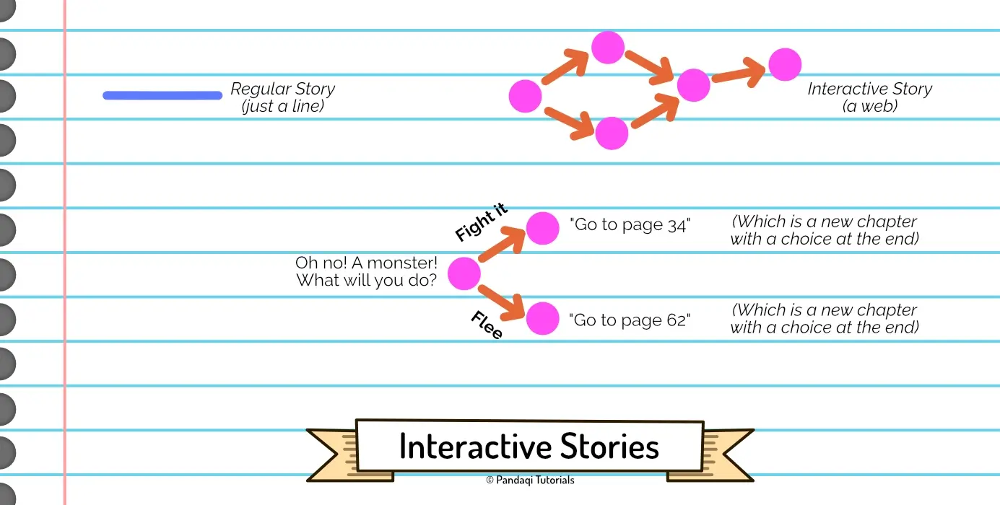
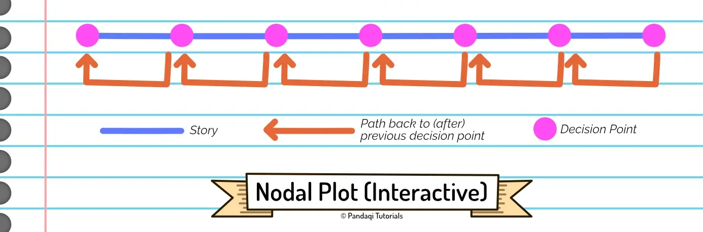
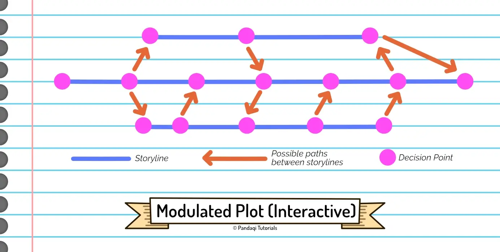
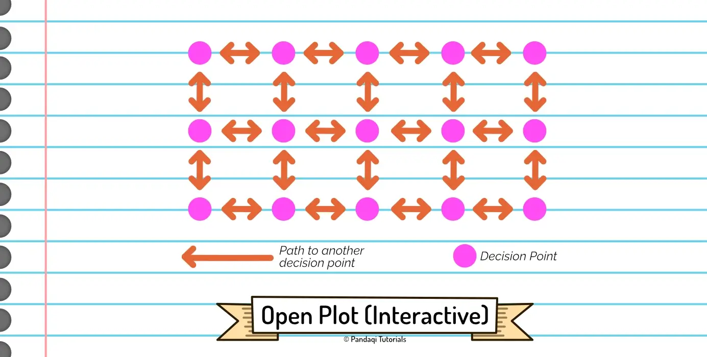

Besides being a writer, I am a game developer. That's why I've always had an interest in "interactive stories". One of my first books was a picture book in which you received an option at the end of every chapter. Depending on what you picked, the story would send you to a different page. Later, I published a "puzzle book". It contained a story, but at the end of every chapter, you had to solve a few puzzles before continuing.

If I'm being honest, these were _mediocre_ attempts at interactive stories. There's a reason why so few of these books exist. It is _hard_ to do it well. And at some point ... you should just create a (video) game, instead of a written story.

Looking back, however, it did teach me a lot about plotting and character decisions. When you create an interactive story, you have to present interesting choices at certain points. Not only that, you have to write the _consequences_ of all those choices. In a sense, creating _one_ interactive story gives you the experience of writing _ten_ (related) plots!

That's why it's a great challenge that I wanted to include.

## What is an interactive story?

Many different types exist. 

* You have "choose your own adventure" books. Regularly, the hero must make a decision. Depending on which option you choose, you are sent to a different page.
* You have (more gamified) "role-playing" books. At the end of each chapter is a "skill check". You may only continue reading if you _pass_ the skill check. Otherwise you are send back, or must restart the book entirely and try again with a different strategy.
* There are many video games that are "narrative-driven". You basically play a character in a predetermined story, making decisions by which locations you visit, which enemies you fight, etcetera.

As always, I want to generalize that in a simple theory you can remember and apply.

> Whereas regular stories can be drawn as a straight line, interactive stories are a web of **nodes** with connections going multiple ways.

Each node is an event. Each node with multiple arrows leaving it is a _decision point_ (or "point of interaction") for the reader.

You have the freedom to create any web you want! Add as many nodes as you like, connect them any way you like. 

There exist, however, three common types of interactive plot.

### Nodal

The narrative is still linear: moving from left to right in a straight line. However, at each decision point, there's an arrow looping _back_. In other words, you can "fail" this event, which resets you to the previous decision.

This is most similar to a linear story. It's the easiest to write and control.

### Modulated

This narrative has multiple storylines. Depending on the decisions taken, the reader follows a different sequence of events, and there can be multiple endings.

In other words, there are _multiple_ horizontal lines (similar to a linear story), but there are many arrows moving _between_ them.

This is harder to write, but also more varied and interactive. This is more like what people expect when you say "interactive story". They expect they can pick their own way through the web, follow an entirely different set of events, and reach different endings.

### Open

An open plot has no fixed storylines or direction. Every node can move to every other node. It gives (by far) the most freedom and interaction, but you lose control over the structure. 

This makes it hard to write, as it's easy for readers to pick a path that simply doesn't lead to a logical (or satisfying) story. 

It's more commonly used to present a _world_ or _setting_ that readers can simply _explore_ (however they like). This is more common in video games with a narrative. They usually connect everything with everything, so you can start wherever you like, and "play" the game however you like.

## What to watch out for

Like in a regular story, the decisions need to be **interesting** and have an **impact**. Don't ask the reader to decide what the hero has for breakfast, or whether to wash his clothes or not.

{}
I once read a "make a decision"-book that only had two decisions. Both of them were not that interesting ("does the hero enter this building or not?") and the ending was basically the same no matter what you did. The "decision" part was clearly a marketing ploy and nothing else.
{}

### Story first

That's why most writers of interactive stories simply write _the story_ first. They write multiple storylines as if they were going to be a linear story, writing interesting scenes and tough challenges for the hero.

Then they simply ... make those tough challenges a **decision point**!

Interactive stories shine if decisions are actually _really hard_ and the consequences serious. If the decisions are similar, then readers will be like "who cares, it's all the same, I'll just pick at random". 

Interactive stories have the power to make readers ask questions, even more so than linear stories. Present them morally ambiguous stories. Present them situations in which _all_ solutions have drawbacks, and it's not clear which solution is the best one. Once they've made a decision, make sure the remainder of their story explores the consequences.

{}
You encounter a monster. You can fight him and win, but the monster will destroy your sword. You can also flee and keep your sword.

To make this choice meaningful, add another event in which you _need_ to have your sword to survive, and an event where you're _rewarded_ for slaying the monster.

Not only is this more fun and engaging, it also turns the book into an actual game. By reading it multiple times, a reader _can_ distill an optimal strategy, based on what they know about all events in the book.
{}

### Decisions first

The alternative approach is to start with the interaction. First come up with the most interesting interactions you can imagine. The most difficult choices. The most fun way to interact with a novel.

Once you have those decisions, build your plot _around_ them. Connect the pieces with bits of narrative.

What's the difference with the other method? The story will be stronger in its interaction, but it's hard to actually get an engaging plot around it.

This is certainly a more rare approach.

## Now write!

Write an interactive story!

* Either start with story, then turn important events into decision points.
* Or start with interesting interactions, then combine them later.

A decision point, in this case, simply means 

* A list of decisions
* And for each decision, a page number the reader should go to.

In any case, you want to maintain a graphic with the **web** for the story.

* Each point (or "node") is a major event.
* Each arrow shows that you can go from one event to another. (Either automatically, or through a decision.)

Try to keep the number of nodes as low as possible, and the number of arrows as high as possible. See how close you can get to an "open plot". Search for creative ways to connect different events through decisions. Make the number of possible paths as high as possible _without_ overly complicating the plot.

Doing this will teach you

* To come up with many different options for every scene, and reason through the consequences of each.
* To see stories as a sequence of "action -> reaction" or "decision -> consequence". The web with arrows helps visualize this idea. If you struggle to create this web, your story is not a story, it's just a list of unrelated events.

Also, interactive stories are just a lot of fun :)