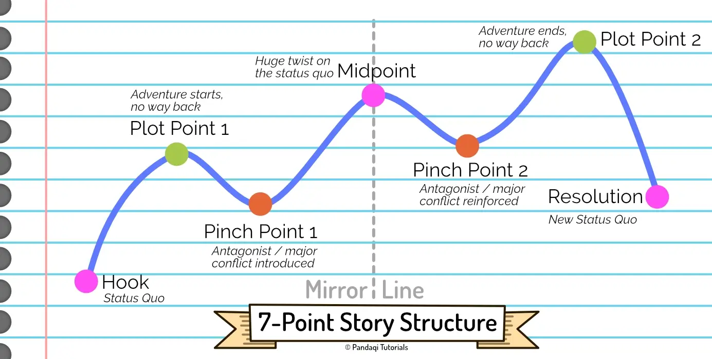

I've moved this structure near the end of the course. Not because it's terribly difficult---I mean, you already know it only has seven points---but because I never knew what to make of it. It floats between all the other narrative structures we've handled so far. That's why, in the wrong hands, it causes a muddled and meandering story. But in the right hands, as many successful authors proclaim, it's the _best_ way to write a story.

## What is it?

If you remember the _sine_ wave from high school ... this structure is just _that_.

* For some time, the conflict rises. (The line goes _up_.)
* Then something big happens, and the conflict seems to slow down. (The line goes _down._)

This repeats a few times, until the final line goes _up_ and ends a bit higher than the other peaks. (To mark that the hero finally, definitively, won or resolved the story conflict.)

I must admit that the images/explanations of this structure are _all over the place_. Some show the final line ending _higher_ than all the others. Which makes no sense, as that'd mean the story ends when the conflict is at its worst, without resolution!

As such, I've drawn the structure in the way I understand it, and in a way that is actually consistent. The line represents the strength of _conflict_, not "is the hero close to winning" or "are we near the end".

The seven points mentioned in the name are ....

* **The Hook**: this is your first chapter in which the inciting incident happens. Something fun, interesting, life-changing happens to the hero. The story is off to the races!
* **Plot Turn 1**: the hero now jumps into the adventure, no way back. (Similar to "crossing the threshold" from the hero's journey.)
* **Plot Pinch 1**: the antagonist or major conflict is introduced, which raises the stakes.
* **Midpoint**: a crucial turning point in the story. The protagonist goes from being _reactive_ to being _proactive_.
* **Plot Pinch 2**: the major conflict suddenly becomes much worse. The hero seems to have lost. (Similar to "dark night of the soul" from hero's journey.)
* **Plot Turn 2**: the hero discovers something that will help them finally defeat the antagonist.
* **Resolution**: the hero finally resolves the major conflict, defeating the antagonist.

## Plot Turn vs Plot Pinch

A **plot pinch** is something bad. The antagonist figures out a new way to add new obstacles. (It might also be an obstacle that was already in place, but the hero only encounters it _now_.) In other words, it's as if the antagonist is holding the hero, and squeezing them _tighter_: a pinch point.

These events move the plot forward, but also serve to _raise_ the stakes (to get that rising action you want in a story) and to reinforce the conflict and how bad it is.

As you see in the image, plot pinches occur in valleys. Their occurrence causes the conflict to tighten up and become more extreme, causing the line to go upward again.

A **plot turn** is the opposite. It might be called "good", though that's not necessarily true. The hero doesn't win, _but_ important things change, and the conflict is reduced for a while. It's like a "minor victory".

With these two elements, your hero is basically slung back-and-forth between the two extremes. Between losing and winning. Between making things worse and making things better. Between finding solutions or failing to do so. It is similar to the Fichtean curve in that sense, or to any structure that sees stories as a _cycle_.

That's why, if applied at face value, this structure will just lead to a meandering story. The hero is all over the place and the reader is like "what's the purpose of this? Let's skip to the end to see how they finally win."

The solution, as always, is to keep in mind the magic words of **change** and **progress**. Every time the plot turns around, this should cause a shift or a change. 

The hero tried again, and failed to win _again_ ... BUT they received a powerful object for their troubles, or realized they need a different approach.

The enemy has shown how powerful they are _again_ ... BUT this time the hero tricked them and was able to extract useful information from the encounter.

For most stories, people _know_ the hero will win in the end. The interesting part is _how_ it happens. The fun part of stories is the journey along the way, and how characters change, progress, and deal with adversity.

If you just follow this cycle of try-fail-repeat _without_ consequences or change, the story becomes boring and unfocused.

## Reactive vs Proactive

We discussed this before, with the Midpoint in the 3 and 4 Act Structure. In the first half of the story, the hero is _reactive_. They are trying to solve the conflict "the easy way". They're trying to get home before dinner.

The midpoint is such a shock, such a turnaround, that this changes. From now on, they do things "the hard way", and will not go home before they've defeated their enemy.

## Symmetric Stories

This structure is also praised for the fact that it's _symmetrical_. (This is also called "chiastic" structure.)

In a good story, the first three points are usually a _mirror_ of the last three points. The midpoint turnaround is _literally_ a turnaround that splits story into these two halves.

This is easiest to see with the start (hook) and end (resolution). In almost all narrative structures, the hero _returns home_ at the end. We start with a status quo, and we end with a status quo ... that has _changed_.

In other words, you already learned that it's nice to _mirror_ the start and the end. The ending should have the same elements as the beginning, but with a few crucial bits altered. The ending happens at the same place as the beginning, but now our hero has learned some lessons and picked up skills.

The same is true for the other points. The two Pinch Points are mirrored, and so are the Plot Points.

What would it mean to mirror those? Well, for a very simple example,

* The first Pinch Point introduces an evil sorcerer who intends to take over the world
* At the second Pinch Point, they have acquired what they needed and actually execute this plan

Both events revolve around the same topic or action. But they're not the same, they're a _mirror_ of each other, so the second time is a different implementation of it.

Looking at plot points, you might go for something related to the hero's flaws.

* The first plot point sees the hero say "I don't need help."
* The second plot point sees the hero beg someone for help.

Again, related, almost the same, but with a crucial change. The plot points are mirrors of each other. Usually, this change is literally a "reflection": a complete turnaround from one side to the other. Where the hero first believed something to NOT be true, now they believe it to BE true.

### Why?

People love patterns. Seeing deeper patterns and structures in stories (or art in general), is part of what gives us enjoyment and makes the art _good_. (I call this "density in art": the more purposes a single scene can fulfill at once, the more "dense" it is, and thus the better.) 

It also helps with cohesion and contrast. The story is easier to grasp if events are mirrors of each other, related to earlier events. The meaning hits harder if it's severely contrasted with a mirrored scene from earlier.

Symmetrical storytelling is very common, because it's an easy (structural) way to make stories more powerful. Now that you know this, you'll find it everywhere.

## Now write!

Write a story using this structure.

* Plan big and interesting scenes at the seven points, which are _mirrors_ of each other.
* Keep the meandering nature in mind: sometimes the hero wins for a while, sometimes they lose for a while.
* But whatever happens, it causes _change_ and _progress_. Just repetition or recycling isn't the way.

Because of its symmetrical nature, people often recommend planning your story that way as well.

* Start with the _resolution_
* Then create your _hook_ (a mirror of the end)
* Then create your _midpoint_ (something that mirrors both resolution and hook, usually a pivotal event that connects the two parts)
* Then fill in the parts in between.

I would never do that, because I am an improviser and do _not_ want to know how my story ends before I write the actual ending. But it's a solid tactic if you're up for a bit of outlining beforehand.

{}
Some call this the "7 Act Structure". For me, this seems unhelpful. Breaking the line into simple points is easier. It clearly shows that you're moving _towards_ the point, and that the point should be _one_ big event. But maybe thinking in terms of "acts" helps you.
{}