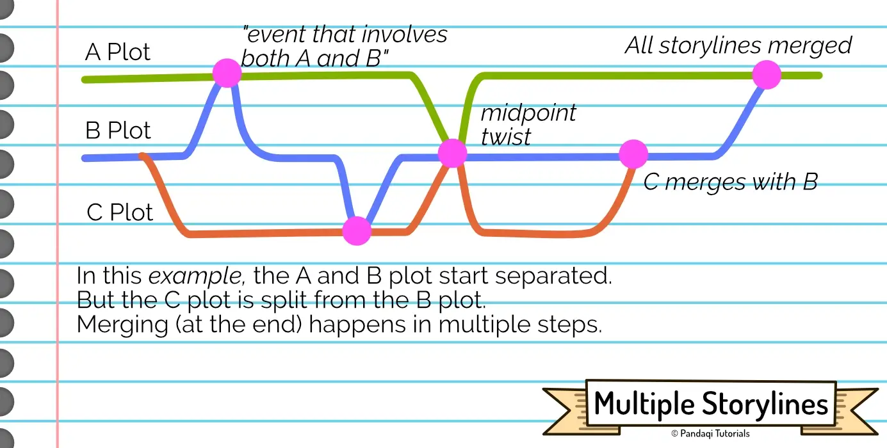

All the narrative structures discussed so far pertain to _one_ storyline. Most stories, however, contain multiple "storylines" or "story threads". Each storyline is an independent chain of events, with its own goal and obstacles. Especially in film and TV, these are often called the A-plot and the B-plot.

Let's practice that now.

In essence, this is an easy step: simply apply a narrative structure to _each_ storyline individually. 

Take the 3 Act Structure. If your book has two storylines, make them _both_ follow the 3 Act Structure. This way, each storyline stands on its own, and you simply have to be creative in how you _combine_ them.

Because they must be combined. That's the first rule.

## The rules of multiple storylines

**Rule 1: they must influence each other.** If your different storylines have absolutely _no_ influence on each other, then why are they in the same book? You can leave one out, and it would change nothing. You should split it into two separate stories.

As such, storylines diverge and converge. They might spend a few chapters apart, doing their own thing. But then something happens in story A, and it influences story B. Maybe they merge permanently after some point, continuing as just one storyline.

**Rule 2: the A-plot is for the hero.** Not surprisingly, the main character should get the A-plot. That storyline should get the most attention, see the biggest change, have the biggest influence. The B-plot thus, by default, is for side-characters and side-quests.

**Rule 3: More than 3 storylines is probably too much.** If you have a complex story with many characters, you can fill up an A, B _and_ C plot! This is actually very common in longer films or fantasy novels. The A-plot is for the hero, the B-plot for characters of lesser importance, and the C-plot is something unique and creative that runs through everything.

More than this? It might work, but it probably won't. It's too much to follow for the reader. It means that it often takes a _while_ before an individual storyline progresses, because you first have to handle the others. If you feel the need to do this, find creative ways to **combine** (or "streamline") storylines. Find a way to put characters in the same place, or align their goals, so they can share the same storyline.

{}
A fantasy series notorious for this is Game of Thrones. It has _so many_ characters, subplots, storylines. But even in this extreme case, there are clear main characters and storylines that are most important. In the case of Game of Thrones, you have only three storylines that take up 95% of story: the Lannisters and what they're doing in their seat of power, the Starks and how they're doing, and Daenarys in the East slowly building up to reclaim that seat. Most scenes clearly progress one of these, even if they add subplots and minor characters into the mix.
{}

{}
This example, however, also shows why I recommend sticking with three storylines and no more. With the 4th and 5th book, the number increases. Suddenly, those 3 major plots are going _very_ slowly---almost like they're paused---while the author introduces several completely new major storylines. It still "works", but it just felt bloated and slow to me.
{}

**Rule 4: Storylines should have a reason for existing.** Let's say your A-plot has your hero seeking some magical artefact. Now you write a B-plot which ... also has your hero seeking a magical artefact (or sends them on some similar quest). There's no reason to do two storylines on the same thing. Leave one out entirely, or merge them into a quest with more steps.

As always, I ask the question of _why_? Why add more storylines? What's the point?

This leads us to ...

## How to combine storylines

> Different storylines should challenge different aspects of our characters (or their world).

If you set them up like that, each will be unique and meaningful. The storyline has a purpose, because it handles a certain aspect that no other storyline handles.

A very common implementation is through the wants, needs and flaws of a character.

* **A-plot**: is about the _want_. This has the most plot, action, spectacle, with the hero trying to get something.
* **B-plot**: is about the _need_. This actually reveals what the hero truly needs to do, learn or overcome.
* **C-plot**: usually challenges the flaws in interesting ways, or actually shows the strengths of the hero. (As much as people like seeing flaws and conflict, they also like seeing _capable_ and _successful_ heroes.)

### Common applications

In the narrative structures previously discussed, there was always a "dark night of the soul" before the climax. A deepest point at which the hero is down and out, certain they will lose. 

How do they get back up? Usually, it's something from the **B-plot**! The hero is focused only on the A-plot, on that external want and goal. In their darkest moment, they seek out whatever was happening in the B-plot, and that will present the answers.

The same is true for mysteries or revelations. The best way to give your reader all the information, but ensure they don't guess the solution immediately, is by giving that information _across different storylines_. One storyline gives piece of evidence A, another gives B, and the revelation only comes when you combine it with the third storyline.

Once you know this, you'll recognize it in many stories, especially animated movies (from Disney and the like). They usually have 2 or 3 storylines. The first one is the premise of the movie and has the most plot/action. The second one usually blatantly states what the hero SHOULD be doing at the start of the movie, then keeps trying to convince the hero, until it finally happens at the climax :p

It is **very** common to make all the storylines meet during the climax. But they should already mention and influence each other throughout the whole story.

{}
This is the valuable feedback I once received on an early fantasy novel of mine that contained 5 storylines. The different threads all combine as time goes on, which caused most editors to say that it worked and wasn't overwhelming. _However_, until the threads met, they did not influence each other. The first 100 pages, therefore, felt like following 5 different stories. To fix this, I rewrote large parts to make the different threads _influence_ and _reference_ each other from the start.
{}

## Now write

Invent two or three different storylines. Make sure they each have a clear meaning and role, doing something that no other storyline does.

Pick any narrative structure (such as the ones discussed previously). Apply this to each storyline individually, but also the overall story as a whole.

Remember the general principles.

* Make sure the different storylines regularly combine or interact, right from the start. ("Promise" the reader that all these separate threads are part of the same story.)
* At certain points, make a revelation or solution come from _another_ storyline. (Especially around the climax, as mentioned.)
* No more than 3 clear main threads.
* The first plot is usually most important and most serious, giving our hero the most to do. Other plots usually fill in the gaps, by being a "funny side-quest", or more of a "philosophical challenge".

Now write this story!