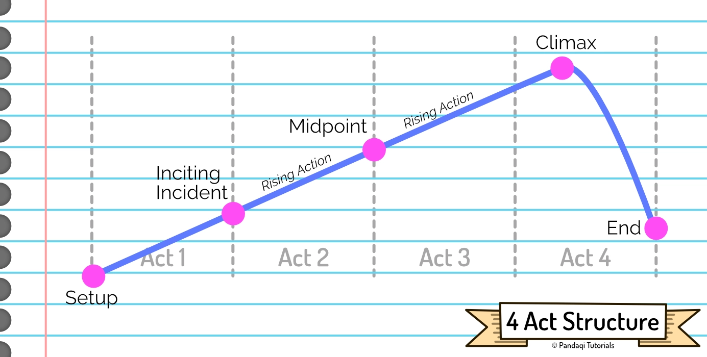
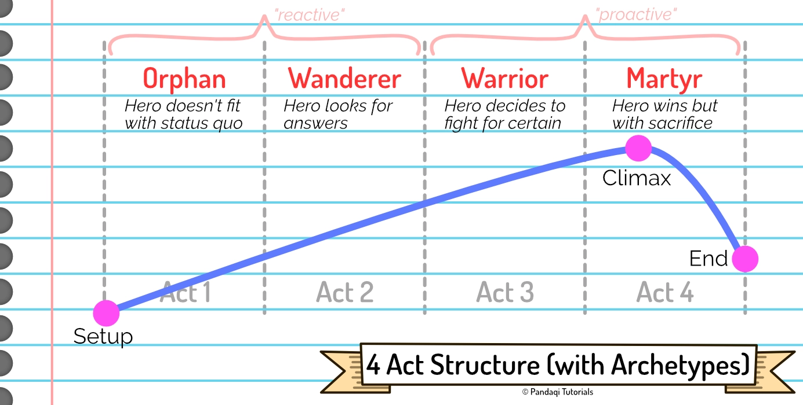

Most people admit that the 3 Act Structure is really a 4 Act Structure. These might seem the same at first glance---and they are. I want to start this chapter simple, make sure we're all on the same page, and then add one extra rule that is really powerful.

## The 4 Act Structure

If you divide it like that, 

* Each act has roughly equal length
* And the midpoint (~50% of the story) is precisely between Act 2 and Act 3, which highlights how important it is

The midpoint is the part of your story that is usually at the biggest risk of being _slow, boring and unfocused_. You're exactly halfway the story, so ... nothing is resolved and nothing new is happening. It can be hard to stay motivated, to keep _progressing_ at this point.

That's why most successful stories provide a "midpoint twist" or "midpoint turnaround". When they reach the halfway mark, some _big_ shift happens. A big revelation, a crucial scene, a major death. Something that absolutely changes everything coming after it.

This reinvigorates the story and gets readers ready for an equally fun last half.

The acts thus become,

* **Act 1**: setup and introduction of conflict
* **Act 2**: rising conflict, until important midpoint twist
* **Act 3**: rising conflict, but significantly different because of the midpoint
* **Act 4**: climax and resolution

This is, of course, almost identical to the 3 Act Structure from last chapter. And still a little vague. So let's take a step further.

## The 4 Act Cycle

I investigated further and combined it with another theory that worked well for me. (This also prepares you for the structure in the next chapter, as it shares some of the ideas.)

Let's attach our main character to the acts in a meaningful way.

Long ago, somebody invented the idea of "archetypes". A set of general personalities which can be used to describe most people. When you look at famous stories, they usually follow the 4 act structure, and they do so using the same four archetypes.

* Act 1: Orphan
* Act 2: Wanderer
* Act 3: Warrior
* Act 4: Martyr

What does this mean?

* The **orphan** is on their own, helpless, cut off. This could be literally (they are a literal orphan, imprisoned, disadvantaged in society, etcetera) or figuratively (they're surrounded by friends, but they just _feel_ like they don't belong).
* The **wanderer** has left this nasty situation in order to pursue their goal. They are ... wandering. They are searching for solutions, trying, making progress here and there.
* The **warrior** has decided what they should do and are going for it at full force. Wandering is over, it's time for fighting and executing on the big plan.
* The **martyr** executes the big plan and saves the day ... but at a sacrifice. They've lost something. Like before, this could be literally (they lose a body part, their life, a friend) or figuratively (they lose their innocence, or their old self)

In a sense, our main character is mostly "reactive" until the midpoint twist. Obstacles happen to them, which causes them to take other routes towards their goal. They still make decisions, but only as a reaction to bad things happening to them.

After the midpoint, however, the character turns "proactive"---a warrior. They actively make decisions, even when not pressed, to defeat the evil before them.

The idea of "sacrifice" matches what I said in the previous chapter, about how the hero should not be the same at the start and the end. This is most impactful if this is a _big_ change, which is why it's important to pick a main character that has a lot of _potential_ for change.

## Now write

Invent a character that is clearly an Orphan. (Or made an Orphan in the first chapter, through the Inciting Incident.) If their current situation isn't dire, they don't have a strong reason to change or act. A bad start will lead to a struggling story.

Pick a word count and divide it by 4: that's roughly how long each act should be.

Now write each act. Remember the general meaning, but mostly remember the change that should happen to your character inside each.

It helps to look at the _transitions_ between acts, more so than the acts themselves.

* Act 1->2: there should be some incident that turns your Orphan into a Wanderer. The incident that creates the conflict and kicks off the story with no turning back.
* Act 2->3: the midpoint twist should put a stop to wandering and slowly figuring things out. Now there's definitely no turning back, and the Wanderer turns into a Warrior. The pace quickens, the plot streamlines, the stakes rise until boiling point.
* Act 3->4: the climax in which the hero ultimately wins, but at the sacrifice of something.

Now write that story.

As always, make a plan beforehand, or edit the story _afterwards_ to fit this structure better. While writing, just write.