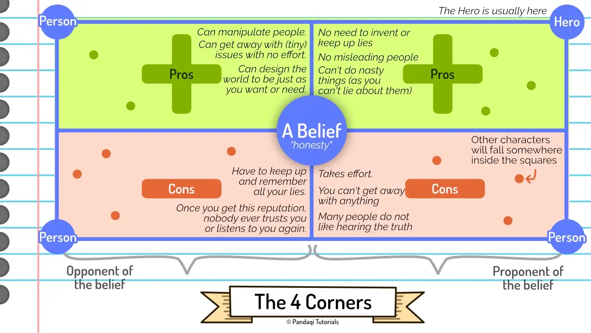

Over the years, I have noticed that I am more of a "societal" writer. I tend to focus on the whole of society in the worlds I invent, not on just one hero and their journey through it. Over time, I developed a theory or system around this that I often apply.

The idea is simple.

* You pick a main character with certain beliefs or convictions.
* You add a handful of other characters that believe the _opposite_.

Now let them meet! Force them to work together! Or make them enemies! This simple trick will ensure your character is challenged all the way. It also quickly establishes the society and world around them. Because, in every society, there will be different people with different viewpoints and abilities.

You can also turn this around. If you have two characters that believe exactly the same things, why are they both in the story? Only keep one of them, make the other believe the opposite! Because, in every society, people still learn to work together or become friends _despite_ these differences.

This could be enough of a structure to work with.

Some time ago, however, I came across another author (Tyler Mowery) who formalized this idea into a bigger theory that I like a lot. As such, I will present that theory now, and you can use that for your next story.

## The Four Corners

Grab a piece of paper and pretend the whole paper is your "society".

Pick a belief your main character might have. Write it down in the center of the page.

Now divide the page in half: a left side and right side. 

* The left side is _against_ this belief
* The right side _shares_ this belief.

(For every decision, you can choose to _do it_ or _not do it_. Similarly, for every topic or personality trait, you can be _for it_ or _against it_.)

Now divide the page in half again: a top side and a bottom side.

* The top side represents what is _good_ about it (the advantages)
* The bottom side represents what is _bad_ about it (the disadvantages)

Now you have four corners! Four different areas, which all represent a different extreme in society.

* **Top Left**: The advantages of **not** having this belief. (Or "believing the opposite", whatever that may be for your idea.)
* **Bottom Left**: The disadvantages of **not** having this belief.
* **Top Right**: The advantages of having this belief.
* **Bottom Right**: The disadvantages of having this belief.

Usually, the hero is the "good guy", so they will be the top right. They have this belief _and_ they aim to represent the good side of it.

Now you add three characters, one for each corner. They will constantly challenge your hero and try to pull them towards their side. At the same time, they can prove a warning or example of why they _shouldn't_ be pulled away.

This is a surefire way to generate a realistic and interesting society around the hero, with just three extra characters.

### Example: honesty

Consider the example from the image: honesty. The hero beliefs telling truth (at all times) is good, and aims to show this through their actions. The person below them represents what could go wrong. For example, it might contain a bitter, exiled character. They told the truth, their king did not like hearing it, so they were punished.

Similarly, create two characters on the other side. One character lies and spreads fake information, and has a _great_ time doing so. They are able to manipulate people. They can get away with anything. Maybe they're amassing power and reputation based on lies alone. Below them is a character who tries the same thing, but is caught, their reputation destroyed and they have to work (for the duration of the whole novel) to get that trust back.

See how easy it is to get 4 interesting characters? With conflict, stakes, consequences, and most importantly a clear _place_ in the society of the story.

## The metamorphosis

We've discussed numerous times how stories are about _change_. The characters need to change.

So how does that work in combination with this theory? If the hero is already at the "good" side, what's there to change?

It depends on what kind of story you want to tell.

* You could tell a tragedy, or a story of a fallen hero, in which they fall from grace (towards another corner)
* You could write a story that makes the hero conclude that the disadvantages of their belief _outweigh_ the advantages, so they end up switching sides and it's (portrayed as) good.
* You could change the hero only a little bit: within each area, there's still room for movement and differences.
* You can change _other_ characters: the hero helps them on the path towards good, the hero changes their life and drags them away from their corner.
* You can use the four corners for society _only_. The actual change of the hero has nothing to do with this. (The belief used for the theory is a secondary character trait.)

As this is about society, however, I'd pick multiple of these options. Everyone in society constantly influences everyone else. Some tensions are resolved, others just ... keep existing.

## Now write

Pick the belief you will discuss and challenge throughout your story. Create the four corners, as you try to come up with as many advantages and disadvantages for both sides as you can.

These are your main characters. Pick one as your hero and try to construct a plot around it.

What events will _show_ their personalities? How could these characters _meet_ or _challenge_ each other (in a natural, logical way)? What goals would people with such beliefs have, and can I use that to construct a plot?

Now write that story.

You'll probably end up focusing more on the world and its richness than usual, just by using this structure.

### Do I pick one of my own beliefs?

That's the beauty of this method. It doesn't matter where _you_ stand on an issue. The four corners ensures that the four possible perspectives are all part of your story. You have to look at the topic through the eyes of all these different people, and understand _why_ they'd be for or against something.

In my view, the author's personality and views should never be part of the story. Writing a story just to 100% confirm your own moral superiority ... rarely leads to a good story. Where's the conflict? The challenge? The interesting deeper meaning? The realistic society?

Instead, a good author should be able to vilify the thing they love, and praise the thing they hate.

Look at it this way. In order for the hero to learn some moral lesson, they have to start out _not_ knowing it. For the hero to turn into a loving friend, they have to be an ignorant jerk first. For the hero to learn equality and acceptance, they have to be racist first.

This structure is a great way to practice that.

{}
It's one of those questions I get a lot. "But Tiamo, you never swear, why are your characters swearing?!" or "But Tiamo, you absolutely despise schools in real life, why does your main character love going to school?!" Because I try to make the decisions that are best for the story, instead of just writing an autobiography each time. I recommend all authors do the same, especially those in Hollywood right now ...
{}