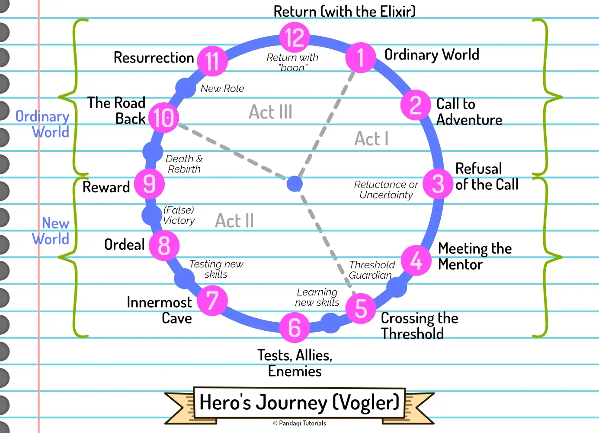
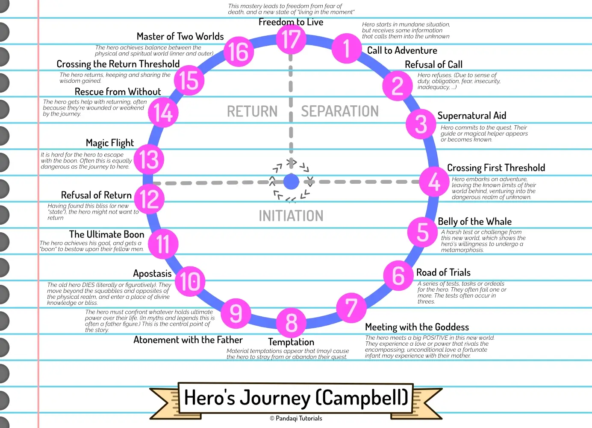

This structure is also called the **monomyth**. It reappears in many myths from all over the world, from all eras of human history. The idea is that _every_ good story, every myth, is nothing more than a hero's journey applied. As such, some people claim there is really only one type of story, and it's this one.

It has many steps and moving parts. Fortunately, we've already seen all of them in the previous chapters. Now they are just combined into one big narrative structure.

After this one, we're done with similar ideas of "acts" and "cycles". We will switch to more varied narrative structures. These will challenge you more and lead to more unique stories, _but_ are less generally applicable. The monomyth cycle is often seen as a core truth, a system that 99% of good stories will use. That's why I wanted to start with it (and variations on it). But after this chapter, we're done with it. 

## How it works

The original Hero's Journey was very much anchored on the genre of fantasy and myths. It used terminology clearly related to that, which made it a bit hard to understand or apply to other genres.

A Disney Executive (Vogler) simplified it and made the names more generic, which is the structure I will present here. 

It's still rooted in fantasy and adventure stories. That's fine, as it is both a fun and easy way to understand the structure. But know that it can apply to any story.

These are the 12 steps of the "clock".

1. **The Ordinary World**. You know it by now. The status quo, the hero's ordinary life.
2. **The Call of Adventure.** The "inciting incident". In many stories, this is a _literal_ call to adventure. Like a message with a cryptic mission, a band of thieves asking another to join them in their heist, Indiana Jones being asked to go and find some artefact.
3. **Refusal of the Call.** The hero is reluctant to take on the challenge. They initially refuse, or backtrack, or try to get off easily.
4. **Meeting the Mentor.** Every hero needs a mentor. They will prepare them and help them through the unfamiliar world they're about to visit. This could be a teacher, a wizard, an exceptionally wise stranger, a parental figure, anyone.
5. **Crossing the First Threshold.** The hero finally embarks on the mission. They step out of their comfort zone and into the unfamiliar, extraordinary world.
6. **Tests, Allies, Enemies.** Our hero faces new challenges, learns new skills, and maybe picks up some new friends (or new enemies/obstacles). This is the "fun and games" section of the story. In a film, you might get a montage of all the things they tried, what worked and what didn't work. The hero is tested, they fail, they learn, they try again. (You might call it "Trials & Tribulations".)
7. **Approach to the Inmost Cave.** The hero gets close to their goal. Fun and games are over. Now they're hitting real obstacles, and failing, and unsure if they're even going to win. They're approaching the end of the road.
8. **The Ordeal.** The hero meets their greatest challenge yet. It is a life-altering experience. They need to "die". Your audience needs to believe that there's a chance the hero does _not_ reach their goal.
9. **Reward (Seizing the Sword).** The hero obtains something important they were after. Victory is in sight---or so it seems. (This is similar to the "false victory" from the previous chapter.)
10. **The Road Back.** The hero realizes that achieving their goal is not the final hurdle. The "Reward" often actually makes things worse, and makes it abundantly clear that it wasn't the _real_ goal. This is the "dark night of the soul", the hero's deepest point in which they're "dead" (figuratively or literally).
11. **Resurrection.** The hero faces their final challenge. This is the climax. A crucial test that hinges on everything they've learned over their journey. To achieve this, they must finally be "reborn" or resurrected.
12. **Return with the Elixir.** Having triumphed, our protagonist returns to their old life.

## Additional remarks

Also notice the little details from the image. These are more "optional", but often present.

* The mentor dies or goes away, usually when they cross the first threshold _or_ at the hero's deepest point. (Because they just lost the only thing helping them and keeping them afloat.)
* There is often a "Threshold Guardian". Something that forces the hero to actually make a decision, to be proactive, to cross the threshold. (So it's not just reluctance holding them back, it's a literal obstacle holding them at home in Act 1.) The moment they cross that threshold can be called "Commitment to the Journey".
* The "Resurrection" is called like that because in many myths the hero actually _dies_, but is then reborn (stronger, more pure, whatever). In most stories, this won't happen, and death will be metaphorical. An important part of the hero dies ... but they are reborn stronger and beat their final challenge.
* Notice how there are several phases for the "return to the ordinary world". In the monomyth, it's often _hard_ to get back. Could be literally (the hero has won, but is trapped and needs to be saved) or figuratively (they have changed so much that return to ordinary life seems impossible)
* When they return home, they _have_ changed. They bring a gift, they assume a new role, their ordinary life will be forever different. In the original monomyth, they come home with a "boon": a gift of kindness or power to bestow upon their fellow men. 

That's why phase 9 is called "seizing the sword" and phase 12 "return with the elixir". To keep the story progressing (and to give your hero hope), they need to get some tangible resource in phase 9: the sword. Something that might help them find the solution in the climax. Something for all their troubles. But ... that resource is _not_ the thing with which they return home: that's the elixir. 

It's the difference between _want_ and _need_, again. First they get what they want, but it's not enough. During the climax, they realize what they actually need, and _that's_ the "boon" with which they return home.

The top half usually happens in the "ordinary world". The lower half of the story takes place in that unfamiliar, new, "extraordinary world".

Sometimes, this is called a **metamorphosis**. During the story, the hero keeps running into their own flaws and inadequacies. They might learn and change a little, but it's not enough, and they lose at first (and "die"). When they finally _shed_ the things holding them back, crawl out of their shell, they are reborn and can win. But it's a metamorphosis, so the hero has changed considerably and can never go back to who they were.

## Now write

This is a very detailed outline. Use it to plan a slightly longer and more complex story.

With this structure, you'll hopefully notice how your story starts to feel more like those classic, favorite movies. It is quite restricting, but also very powerful. As explained in the previous chapters, it just hits something at the heart of every human, at the heart of every story.

Remember that act 1 and act 3 are longer than you'd think. If you start the story with immediate action, you don't have time to setup the status quo and the ordinary life the character is leaving behind. This lessens the impact of the journey.

Also remember that it's called a "Hero's Journey". You can certainly write a story that is not about one hero (or a journey towards goodness). For example, there are certainly stories that have no clear protagonist, or stories where you actually follow the bad guy. Those kinds of stories are harder to pull off and wouldn't typically use this narrative structure.

## The advanced version

Below is a graphic showing the original monomyth, with more steps with more complicated explanations. In this sense, it is more "spiritual". It's more about basic human vices, desires and temptations. While they always provide a good core for a story, they can also be hard to write a good plot around.

{}
Some versions of this journey (or other story circles) go in the opposite direction (counter clockwise). I do not know why and I find this endlessly confusing. Just keep this in mind if you ever research more narrative structures at other sources.
{}

