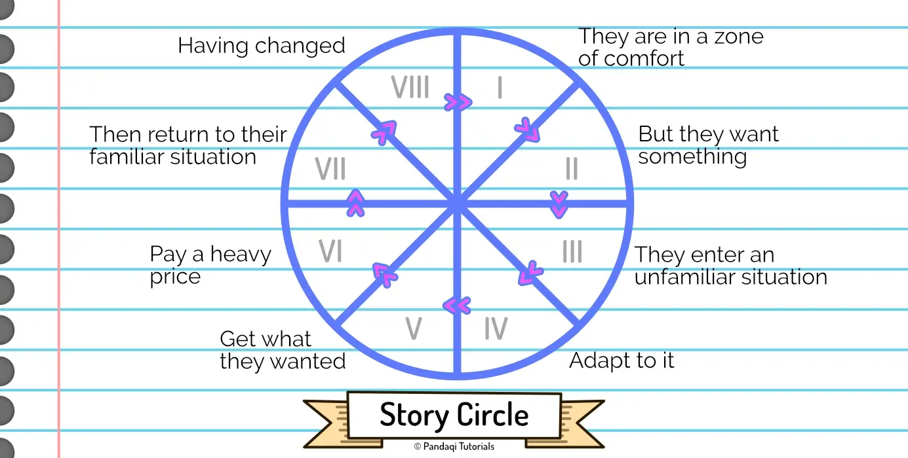

The story circle is usually attributed to famous writer Dan Harmon. It's a simplified version of what the next chapter is about (the Hero's Journey). In fact, it is _heavily_ simplified, focusing only on what Dan sees as the core truth about humans and stories.

This approach is therefore ideal for **episodical storytelling**. Like episodes for a TV series, or a bundle of connected short stories, or those online websites that allow you to post a new chapter every week.

That's also the reason why it's a **circle**. After the story is over, you've completed the circle, and the hero is back to start the _next_ adventure!

## How it works

This one is simple enough to explain with an image.

1. **A character is in a zone of comfort.** They're living their ordinary life. It does not challenge them.
2. **But they want something.** The reason for wanting it can be quite stupid or simple. Maybe someone just has this enormous inner desire to get something. But they should want it _so bad_ that it compels them to action.
3. **They enter an unfamiliar situation.** The hero "crosses the threshold" (remember that from the 3 Act Structure?). They pursue what they want, but hit all sorts of obstacles in this unfamiliar world.
4. **Adapt to it.** They slowly figure out how to survive the new world, and acquire the skills to do so.
5. **Get what they wanted.** They achieve their goal! But this is a "false victory"---it comes at a cost. This is their **want**.
6. **Pay a heavy price for it.** Unexpected issues follow the victory. Similar to the idea of "sacrifice". Now they realize their actual **need**.
7. **Then return to their familiar situation.** The hero returns to the place or state of the first phase (the status quo, whatever it is).
8. **Having changed.** The status quo is slightly different. The lessons the hero learned stay with them, and they have grown, unable to live life as they did before.

Now notice a few things.

* It's a circle, so use enough time to setup the status quo at the start, but also to show how it has changed when the hero _comes back_ to it at the end. 
* It's also a rather simple circle, which means the lesson for your hero can be a small one. In a TV show, for example, you cannot add life-changing lessons every episode. It would be way too much! You can only add small victories and progression; this circle is ideal for that.
* It has many similarities to the 3 Act Structure. There's a reason it is probably the most well-known narrative structure, with some even calling it the only way to do a story.
* The parts are roughly equally important. As such, the "false victory" happens just over halfway the story. It is not the climax or the ending. No, the climax is the _consequences_ of achieving this goal, and how they reveal it wasn't actually what the hero needed.
* The ideas I explained at the start of this course naturally flow from it. (It automatically creates a flawed character that grows, with a want and need. It has the three Elements of Storywhy: meaning, change, and a framework for entertaining plot.)

## Why it works

Harmon points out that all of life and nature works cyclically. Day and night, life and death, growth and decay. It is simply unnatural and unsatisfying to us if a story breaks this principle. If, for example, the hero only keeps winning and winning, and the story just ends when they stand at the edge of the world and have absolutely everything.

He also points out that this cycle helped humans survive and evolve: "search, find, take, return with change". A very simple observation, but nonetheless true. Of course we can only progress if we search, find, take, then return with the thing.

As he puts it:

> "If our heroes just climbed beanstalks and never came down, we wouldn't have survived our first ice age."

Humans constantly want stuff. We want to explore, discover, find love, invent. Once we've lived on this earth for a few years, we probably also have some bad things we want to get rid of: we want to get rid of our anxiety, we want to re-establish the bond with our parents, etcetera.

As such, this cycle is the simplest way to make your story stick with every human being.

Harmon goes even further: "if your story doesn't use this, it's not bad storytelling---it's simply not a story."

## Now write

Apply the circle! Even better if you can write a few "episodes": a few short stories that follow up on each other.

If you do that, you get more practice with the circle, but also with how to use it in longer storytelling (by repeating the circle with every story).

Now let's go to the big, more advanced brother of this idea. The Hero's Journey. Whereas the story circle is ideal for short episodes, the hero's journey is what you'd use for a full-length novel. 

{}
Yes, with fear in my heart, I'm telling you that you're (almost) ready to write longer stories. If you've done all the exercises so far, of course!
{}