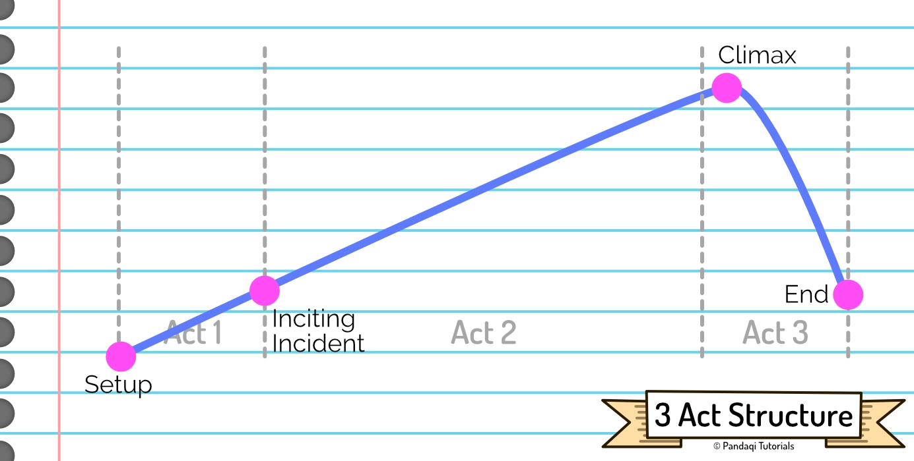
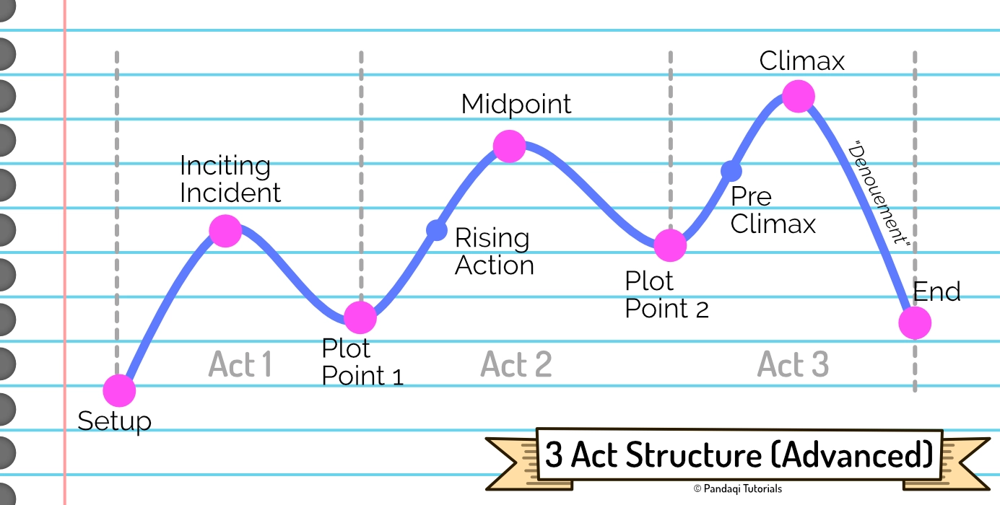

Let's continue with the most common structure (probably). One that is mentioned absolutely everywhere, although I like the "advanced" version more than the simplified one.

## The 3 Act Structure

This is the common structure mentioned in most writing guides. It's also vague to the point of being useless. Here's the idea.

You divide your story into three acts: beginning, middle and end.

* **Act 1**: the setup, status quo, exposition. It should contain the "inciting incident" (the extraordinary event that definitely puts the story in motion) somewhere.
* **Act 2**: the meat of the story, in which you slowly build towards ...
* **Act 3**: the climax. The biggest, coolest scene in which all conflicts are finally resolved. Afterward, the story cools down until it reaches the end.

This gives a nice sense of an _overall arc_ to the story. You start slow and simple, then something weird happens and tension ramps up. The story keeps going faster, with tensions rising, until it is all _released_ in the climax.

Throughout this course, when I present such an image, the line represents **conflict** (or stakes/tension). As the line rises, the stakes increase and the conflict becomes more tough.

## The Advanced Structure

The three acts, as described above, are very vague and not that helpful. They merely tell you that "stories should start simple, ramp up as they go, until they reach a climax with the biggest event". As you try to fill in the gaps, you can easily make the wrong assumptions.

{}
Beginning writers often see that Act 1 is called "exposition" or "setup", and think they can fill the whole thing with just _information_. They'll happily tell you facts about the world and the characters for 10 chapters, before Act 1 is over and they finally start with the story. Obviously, this is NOT the way! The story should start and get interesting immediately.
{}

As such, I'd rather tell you the advanced structure with a bit more detail. 

### Act 1: Setup

* **Exposition**: establish the "status quo". What does the ordinary world look like? What's normal for our character?
* **Inciting Incident**: the event that sets the story in motion. It's the extraordinary thing that **interrupts** the status quo.
* **Plot Point 1**: the hero finally decides to go for it. They "cross the threshold" and cannot go back to the status quo anymore. We are now in Act 2.

Note how the inciting incident is an _interruption_. It can't just be a weird event, or something interesting, and the hero can _continue living as they always would_. It needs to interrupt the status quo in such a way that the hero just cannot continue like usual. It's an extraordinary interruption.

The difference between "inciting incident" and "plot point 1" is often misunderstood or simply not known to beginning storytellers. They think that Act 1 should be really short: you have your first chapter, it ends with the inciting incident, and boom we're in Act 2.

In reality, Act 1 should be roughly 25% of the story, Act 2 50%, and Act 3 the last 25%.

There's this period between "something happens" and "the hero must leave home to fight it". This period is used to ...

* Give more exposition, but in a fun and natural way. (You can _show_ the character of the hero by how they try to ignore the problem the first time.)
* Set up elements that might be used ("paid off") later in the story.
* Show that this _really_ upsets the status quo. If something happened, and the hero was immediately like "yeah, cool, I'll deal with that", it'd feel like the event wasn't significant. The reluctance, the refusal, the difficulty with accepting the obstacle is a crucial part of the 3 act structure.

In this structure, the hero always "ignores" the problem at first. You can get creative with the reasons why. (Maybe they think they first need to "prepare". Maybe they think they can get away with minimal effort and continue their old life. Maybe they're just arrogant, or insecure, or they have family ties keeping them back.)

{}
Take "The Hobbit". It starts with Bilbo being visited by Gandalf and asked to go on an adventure. He refuses. We spend a bit more time explaining his (boring) life and the status quo, until he finally decides he _does_ want to go on an adventure. 

That's when Act 1 ends. Due to this structure, we have a better picture of Bilbo and the world before the adventure kicks off. Which of the two events is the inciting incident? I'd say the first, some writers might say the second.
{}

### Act 2: Confrontation

* **Rising Action**: the hero grows familiar with their new world. They might solve the initial obstacle, but a new one is put in front, bigger than the previous. They do some good things (like getting allies or minor victories), they do some bad things.
* **Midpoint**: an event, halfway the story, that completely changes the trajectory. It upends the hero's mission and makes the latter half of the story decidedly different.
* **Plot Point 2**: after this world-shaking midpoint, the hero gets their biggest test and fails it. We move into Act 3.

The "rising" part is important here. Solving one obstacle, just to see it replaced by a similar one, isn't interesting. Do this for a full novel, and nobody reaches the end.

Obstacles need to be followed by _bigger_ obstacles. The tension *generally* rises all the way through Act 2, although it can fluctuate between moments of triumph and moments of great loss.

### Act 3: Resolution

* **Pre-Climax**: also called the "dark night of the soul". This is the deepest point for our hero, in which they just had their biggest failure, and have to look in the mirror and see what they're made of. They must pull themselves together and find a plan to get out of this hole.
* **Climax**: the hero faces their enemy, their biggest obstacle, one last time. This is usually the biggest scene, with all story lines converging, and everything you've set up during the book being paid off.
* **Denouement**: the story quickly tries to get down from its highest point. All loose ends are tied up, the consequences of the climax are discussed, and finally a **new** status quo is established.

If you set up everything well, the climax will follow quite naturally and will not be the biggest issue. In fact, you can make this a rule.

> There should be no NEW information in act 3.

Everything has already been set up. Act 3 simply means the hero finally _understands_ all the information correctly, combines it, and acts on it to reach the climax.

The denouement is the great test of your story. If you find that _nothing has really changed_ ... then your story has failed. If your hero just goes back home, having learned nothing, having lost nothing, and home is the same as always ... then what was the point of the whole story?

Yes, events in real life are often pointless. Stories are meant to be a "more interesting" reality, in which everything has meaning and consequence. People want there to be a point to it all. They want the hero to return home, but home is different, and the hero is different.

## Now write this!

If you like planning more, plan the parts of the 3 Act structure ahead of time. Once you have a clear outline, write that story.

If you're more of an improviser (like me), only come up with the first parts (exposition and inciting incident), then write. See where it takes you. _After_ writing it, go over the story and edit it to fit the structure more tightly. We're here to _learn_, not to provide a perfect story first try.

{}
As I said, you can try to "keep the structure in mind" while writing, but you just ... can't. It's too much. It blocks you, leads to doubt. While writing, only think about putting the story on paper. Use the phases before and after to edit it towards the structure. 
{}

Now let's up the number of acts from 3 to 4 ...