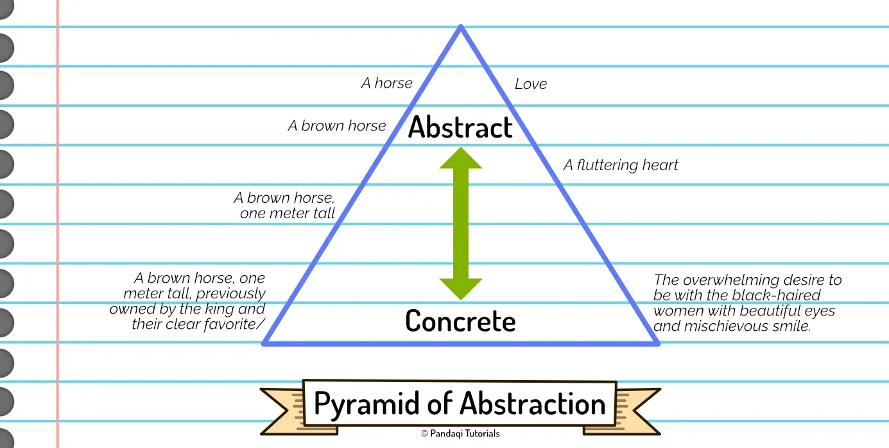

Previous chapter gave you an idea of the general things to communicate and how to do it. But when is the right time? In what order should information be conveyed?

## Pyramid of Abstraction

In general, adhere to the "pyramid of abstraction".

Humans are physical beings who live in the _real world_. As such, we connect more easily and care more about _concrete_ (physical) details, rather than abstract concepts or ideas.

As such,

* Start by conveying the concrete, physical, tangible details of your world.
* Once you've established that, pull back further and further, until (near the end of the story) you can make a more abstract or profound point.

I see too many stories that start with huge questions that sound philosophical. Yes, it might create a nice marketing slogan or garner a little interest, but it can't sustain an actual story. 

People don't get invested in an abstract thought or profound concept. They get invested in the tiny details that make them care about the characters and the world. Only if those are conveyed (well), can you eventually end up at bigger ideas.

There's a great quote about this.

> "If you want the reader to believe you about the big things, first make them believe you about the little things."

{}
The first Wildebyte story is about freedom or free will. This character is dropped inside a video game, and now others are controlling what they can or must do! However, I do not open with this thought or idea. It would be a terrible and slow opening.

The story simply opens with a concrete, specific action scene about figuring out this new video game world. A scene in which I _show_ how sometimes another takes control of them and commands them.

Only halfway into the story, once you've learned the specifics of the world and have lived in it a while, do I pull back more and more. Wildebyte slowly sees how the rules of the world naturally cause them to lose free will and they start to fight it.
{}

## Concrete vs Abstract

Sometimes people call this **specific** versus **vague**. I, however, learned that a slightly different definition is more useful.

**Concrete** means that the audience all imagine the same thing in their head. You've given _specific details_ that paint very similar pictures in the minds of the audience. For example, "a girl wearing black boots, a black dress, and black sunglasses partially covering hazel eyes".

**Abstract** means the audience all imagine different things. You've left out so much information that the audience fills in the gaps with personal biases and life experiences. For example, "a girl".

Concrete means that there's less confusion among readers and you paint a more vivid, clear image. The disadvantage is that it takes more words, which causes the story to slow down. (And it's more work for you, the author!)

Abstract allows you to easily talk about themes and higher concepts, allowing the audience to draw their own conclusions or add their own imagination. The disadvantage is that it can be hard to understand or lead to disparity about what the author meant. It also tends to feel like a lecture from the author, instead of realistic thoughts from a character's point of view.

In this definition, abstract concepts like "love" or "loneliness" are pretty much the same as "a girl". They're equally vague. In fact, "a girl" might be _more_ vague. Humans have similar experiences and feelings connected to "love", but when you tell them to imagine any girl, they'll all imagine completely different beings.

As you see, concrete is usually better, but not _always_. It takes more words and more work. You want the concrete details to be in _service_ to abstract ("less tangible") thoughts or themes.

If you want a scene to intentionally feel vague, mysterious, or spiritual ... you might use abstract language on purpose. Alternatively, if you want to show how grounded and down-to-earth a character is, you'd probably shroud them in almost 100% concrete language.

## Tips for Prose

That's why many writing courses advise you to cut a lot of words (passive voice, adverbs, descriptions). 

It's not that they're useless. Saying somebody had a "machine gun" certainly conveys different information from saying somebody just has a "gun". More information is more information!

But realize that not all additions are _necessary_ or make your writing more _concrete_. Some additions or details are irrelevant and merely add more words (or "noise on the line").

Below are the most common mistakes.

* **"Tell, then show"**: first you write a line that states something literally. Then you _show_ it as well. Unnecessary! Just remove the telling line.
* **Vague information**: we tend to add many phrases that have no concrete meaning. "He stepped forward a tiny bit". A tiny bit? What's that? What information does it add? Nothing, because it's not a concrete statement.
* **Duplicate information**: similarly, we communicate the same thing multiple times in the same sentence. "He whispered softly" is pointless, as whispering means "to speak softly". 

{}
This is a "tell then show": He was afraid. He stood frozen, his eyes unblinking, a chill through his spine.

The second line shows he is afraid. So why include the first line? And if you decide that showing is too heavy-handed, remove _that_ line and only keep the first.
{}

Erasing such habits from your prose will save you thousands of words. This frees up space to _actually_ give concrete, specific, precise information. It's common for these things to your first draft; just make sure you edit them out on later drafts.

But prose is another topic entirely, covered in my course on [Prose](../../prose/).

In there, I also mention a related concept called the "ladder of abstraction". It advises you to _vary_ between sentences that describe specific details and action, and sentences that give more abstract or broad thoughts. This variation adds a nice flow to your prose.

What's the difference with the pyramid? That one applies to larger arcs or storylines and is mostly a one-way street. Start your story with specifics, with multiple scenes grounded in a concrete reality or action, and only become more abstract near the end. 

Also, the base of the pyramid is obviously much bigger than the tip. This helps remember the proportions: most prose should be concrete description---only a tiny portion should be abstract.