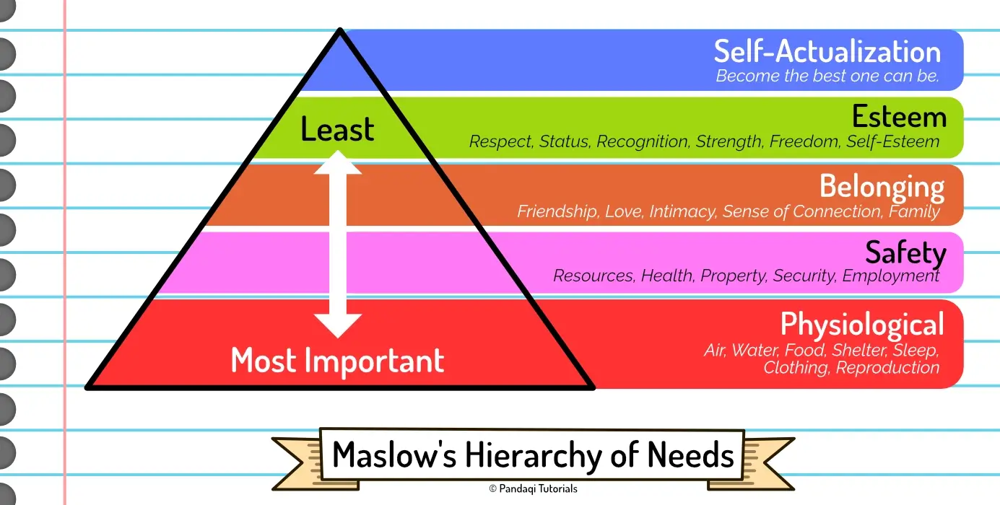

I've seen and heard a lot of critical story analyses. A very common critique is that the story was "nonsensical". They didn't feel immersed in the story, didn't think the plot believable, because the world around it just "didn't make sense".

Most often, they support this by asking questions about basic needs. Questions like "where do these people get their food?!" or "who is in charge here and why!?" which the story fails to answer.

It's only logical that humans give priority to basic needs. That we have this infallible intuition that tells us a world is illogical if it doesn't address how a civilization _could_ survive and prosper.

That's why I made this step two of the process. Once you've figured out the core idea for your new world, think one step further about how basic needs are met.

Remember the _iceberg_ metaphor, though. You don't necessarily need to _explain_ all this in the story. You just need to think about it and make sure there are simple and clear answers. Explicitly or not, these answers will shine through in the story you tell. In the end, the audience will feel immersed and won't struggle with things that "shouldn't exist" every scene.

So, what are these basic needs?

## Maslow's Hierarchy of Needs

For this, I'll refer to Maslow's famous pyramid. It displays the "basic needs" that every human has. 

How does it work?

* The most important ones are at the bottom. (Food to survive, air to breathe, ...)
* Humans only move to the next layer (upward) once these needs are met.
* This continues until the top layer is the need that is most abstract and has the least "priority"

{}
In practice, this is obviously more vague. It's not like somebody can't feel the need for safety or love if they're hungry right now. The lines are a bit more blurred and needs do not need to be met 100%. But that's not so relevant here.
{}

When building your world, you generally want to have answers for the bottom two layers: physiological needs and safety needs. Without these two, the people who inhabit your world would have quickly gone extinct (or struggled to form any semblance of civilization).

Example questions are:

* Where does food come from? Where does water come from?
* Where do resources/materials come from?
* How do people live and find safety/shelter?
* Is the air safe to breathe? Does your story feature a non-human race that has other needs?

So take your core idea, then think about the implications for these. You will probably find creative or surprising answers that make your world both more interesting and more realistic.

Higher layers are often the part in which stories are actually told! They're more emotional needs, more malleable needs. Because you can change them, you can _design_ the world to be one way, then have your character eager to _change_ or _fight_ that. 

Example questions are:

* How do people socialize and what groups have occurred?
* Who is in power and how does that system (including laws and or policies) work?
* What abilities are seen as good/capable/useful? Which are seen as bad or dangerous?
* What's the role of family, friendship or love?

{}
The typical example of that is an oppressive government. Yes, people might have little food or wealth, but their basic needs are at least met by the government. The issue is with a hero who simply does not _accept_ that they can't have a higher need (such as freedom, respect or status) and thus try to topple this government.
{}

{}
A Romance is anchored in the third layer. When writing a Romance, your characters don't need to fight for food or shelter every day. That'd really detract from the story and probably turn off many readers. Instead, their basic needs are met, and the story is about trying to meet the need for Love.
{}

## Conclusion

If you want your world to "make sense" to a (human) audience, it needs to have answers for how they _survive_. The most basic of needs (food, water, shelter, safety, reproduction, ...) need to be met.

It's nice to find answers to the needs higher-up, but it's not necessary. Instead, your story will often be about one of those (higher) needs and how characters have to fight to _get_ them. 

The whole point is that humans can't survive without food, but they _can_ survive without love or belonging. In fact, many people are in the sad situation that they must live without such things, and stories are created from heroes who don't accept that and will fight for a better life.

That's almost a textbook definition of a hero. Somebody who worked hard to reach the top of the hierarchy of needs: to become the very best they can be. One might argue that all stories are about somebody trying to ascend this hierarchy.

But this ascension has to start somewhere: the bottom layer, their current world. Hence, make sure those basic needs are met in your invented world.

{}
This also means that you _can_ write a world in which those needs aren't met, and the story is about survival or building utopia from dystopia. However, because you start at such a low point, this usually requires a series of books (or multiple season of television) to reach the top of the hierarchy.
{}