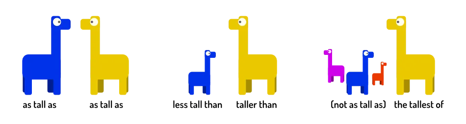

Well done! You have learned all about the two basic blocks of English language: _nouns_ and _verbs_. You should be able to read and write any basic sentence---with any time or intention.

At the very start, though, I also mentioned two advanced concepts. Something I called "modifiers" that can change what a word means and give more detail. 

You could say: "Two girls walk down the street. One finds a wallet."

But then we'd all be wondering: what do the girls look like? Which of them finds the wallet? How can we distinguish them? What does the street look like? Where are they?

Adjectives help _specify_ nouns by adding detail. Like: "A **short** and a **tall** girl walk down **main** street. The tall one finds a **green** wallet."

There are two big groups of modifiers:

* Adjectives: change _nouns_
* Adverbs: change _verbs_

This chapter and the next will discuss both. Let's start with adjactives.

> **Adjectives** modify or describe nouns

{}
Red 🔴, green 🟢, sleepy 💤, loud 📢, forbidden ⛔, bright 🔆, hot 🌡️, boring, beautiful, tall, short, nice, friendly, best, great, ...
{}

## Placement

There are two ways to place adjectives:

-   **Before the noun**: Yesterday, I placed a _small_ table in my _big_ house.
-   **After verbs of being or perception:** My house is _big_. The table seems _small_. The room _feels_ cramped.

Adjectives don't change their form based on the gender or number (singular/plural) of the noun to which they belong. They always stay the same.

{}
Yes, we've seen those verbs of being and perception many times now. They are a special class of verbs that allow these special grammar constructions, which are short and useful. In many cases, a rule doesn't apply to all verbs, but only this specific class.
{}

{}
The adjectives *involved, present* and *concerned* can appear behind the noun. But that changes their meaning.
{}

## Comparing

Humans love to compare. We're simply very good at comparing and recognizing patterns. As such, grammar for comparisons is available in nearly any language.

Comparisons are written based on their result. They can be _equal_, _different_ ("unequal"), or have one _clear winner_.

This is the _only_ situation in which an adjective changes how its written. Namely, we need the _comparative_ and _superlative_ version. (Those are explained below.)

-   Equal; **as + adjective + as** => *Jack is as tall as Jim*
-   Unequal; **not as + adjective + as** => *Jack is not as tall as Jim*
-   Unequal; **less + adjective + than** => *Jack is less tall than Jim*
-   Unequal; **comparative adjective + than** => *Jack is taller than Jim*
-   Clear winner; **the + superlative adjective** =>*Jack is the tallest of the two.*

## Comparative & Superlative

How do you form this special adjective syntax? It depends on the number of syllables in a word.

### One syllable

Add **-er** for comparative and **-est** for superlative. 

If the adjective ends with a *single vowel + consonant*, you need to double the consonant.

{}
Tall (🦒) => Tall**er** (🦒🦒) => Tall**est** (🦒🦒🦒)
{}

{}
Sad (😥) => Sad**d**er (😥😥) => Sad**d**est (😥😥😥)
{}

### Two syllables

Some of these use the same pattern as above. (Use "-er" for comparative, "-est" for superlative.)

But for some, you'll immediately notice it becomes hard to read or pronounce. In that case, you don't modify the adjective, but place a helper word in front: **more + adjective** for comparative, and **most + adjective** for superlative. 

If you are not sure, you can always play safe and use that system. 

Adjectives ending in **-y** need to replace it with an **-i**.

{}
Happy (🤗) => Happier (🤗🤗) => Happiest (🤗🤗🤗)
{}

{}
Tilted => More tilted => Most titled
{}

### Three syllables

These adjectives always follow the pattern of adding *most* and *more* in front. (Changing the adjective to add something would make them _too long_.)

{}
Important => More important => Most important
{}

{}
Beautiful => More beautiful => Most beautiful
{}

### Irregular

Like verbs and nouns, the _most important_ or _most common_ ones are irregular. They don't follow these rules and must be memorized.

| Normal Adjective   | Comparative         | Superlative |
| ------------------ | ------------------- | -------- |
| good               | better              | best |
| bad                | worse               | worst |
| little             | less                | least |
| much               | more                | most |
| far                | further / farther   | furthest / farthest |

## Quantities

At the start of this course, we talked about *countable* and *uncountable nouns*. 

If you want to compare *quantities*, this is important again.

| \-              | A = B   | A = B    | A \> B   | A \< B |
| --------------- | ------- | -------- | -------- | -------- |
| *Countable*     | many    | few      | more     | fewer |
| *Uncountable*   | much    | little   | more     | less |

The first "A = B" is when two nouns are equal and _numerous_. There are a bunch of them. There's no shortage.

The second "A = B" is when two nouns are equal and _scarce_. They are almost depleted. You don't count many of them.

{}
* There are **as many children** on the playground **as** ants in the world. ( = there were a lot of children there)
* We had **little money** ( = they didn't have a lot of money, money is uncountable)
* He had even **less patience** than Jim.
* They had **fewer points** than the other team.
{}

{}
These days, many people forget that some of these words exist. Everything is "less". Less money. Less birds in the tree. Less ideas for my next tutorial. This is **wrong**. Fewer birds in the tree. Fewer ideas. But the mistake is so common, that this is hard to avoid.
{}

## Multiple mdjectives

There's no fixed order to follow when using multiple adjectives in a row. 

There is, however, generally accepted order that feels most natural:

> Quantity => Value/Opinion => Size => Temperature => Age => Shape => Colour => Origin => Material

{}
* The two beautiful birds. (🐦🐦)
* The large, cold ice cream. (➕🧊🍦)
* The two ten year olds. (👦👦)
* The rectangular, green box. (🟩)
* The awesome metal car. (🏎️)
{}

## On usage
As you can see, adjectives add more detail and information. But they also increase sentence length and complexity. 

Therefore, do not stuff every sentence with adjectives. Only use them when crucial or quite useful. "White snow" is just snow. "Green grass" is also just grass. "The old worn damaged book" is a bit overkill, one of the adjectives should be enough.

In some cases, you can find a single _noun_ to replace _adjective + noun_. A "young human" is obviously a "child". An "automated vehicle" is a "car" or "automobile".

{}
In Dutch, this is simply called an "auto". For years, as a kid, I thought English used the word "auto" as well and didn't know what those weird "cars" were.
{}

_What if an adjective isn't strong enough?_ Maybe that isn't just a damaged book. It's almost falling apart!

To *intensify* adjectives, you can use words like **very**, **really** or **extremely** in front of them. 

But those are actually ... adverbs! Because you can also use them to intensify verbs.

Well, isn't that nice, the next chapter is about that.