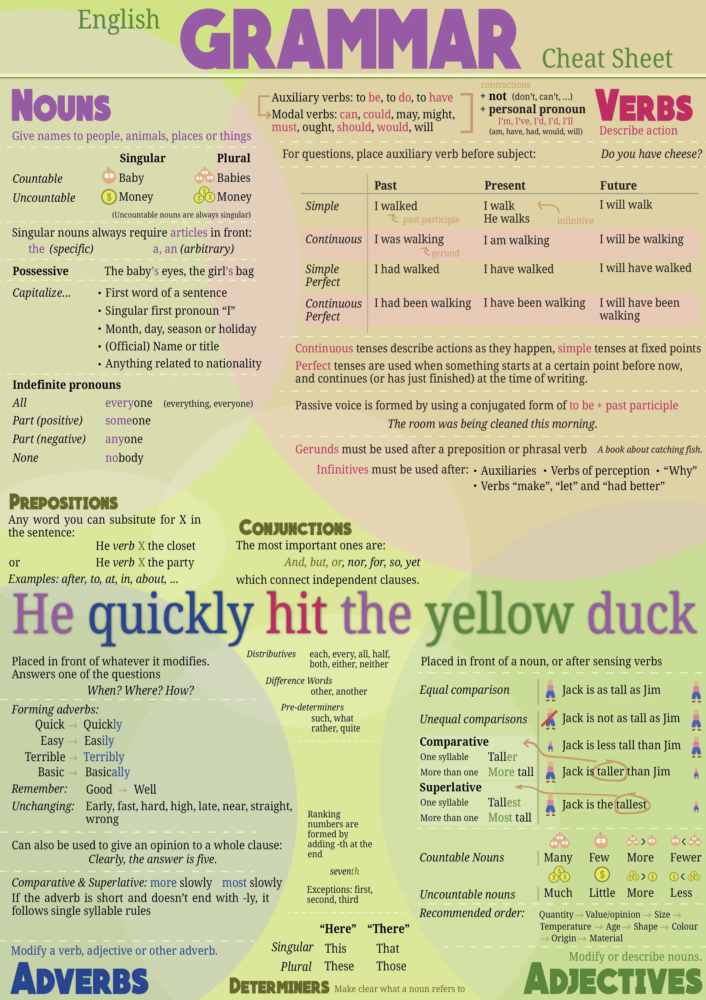

Use the image below to quickly remind yourself of the basic grammar rules. In case you are in doubt or forgot something. 

This is no replacement for reading the full course. As I explained at the start, this course isn't even that valuable.

**The only way to learn a language, is by reading, writing and speaking it a lot.**

Even Duolingo will only burn a few words/phrases in your brain, and that's it. Immerse yourself in the language. Try, every day, for a long time, to use it for everything. 

That is how you will master English.

And now I present: the English Grammar Cheat Sheet!

This course continues for a few more chapters. Those explain some concepts that aren't crucial to know or that were too specific to explain earlier. (For example, I never taught how to read a clock or write dates/time.)