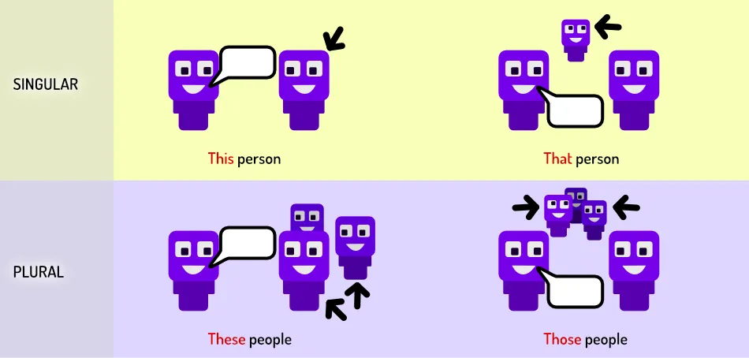

You've mastered the basics of English language ... almost. Only two more chapters. This one will talk about the many simple but _crucial_ words for making everything work.

I could have sneakily spread them all throughout the course. (And I did, a bit, in the examples.) But I think that would have made it too messy and confusing. That's why I'm presenting it as one group here.

> **Determiners** are placed in front of a noun to make clear to what it _refers_

{}
**My** hat, **these** people, **a few** birds, **ten** children, **other** options, ...
{}

Determiners have 9 subcategories. Fortunately, 5 of them have already been discussed:

-   **Definite article:** *the*
-   **Indefinite article:** *a, an*
-   **Possessive determiners:** *my, your, his, her, its, our, their*
-   **Quantifiers:** *a few, a little, much, many, most, some, any, enough, a lot of*
-   **Numbers**: *zero, one, two, three, four, ...*

The others are explained in this article.

## Demonstratives

Demonstratives have two separate functions:

* Referring to a noun mentioned earlier (in the sentence or paragraph).
* Showing placement or position of something.

They are placed before the noun. If the noun was mentioned previously, they can be used *on their own*.

| \-                         |  Close by ("here")    | Far away ("there") |
| -------------------------- | --------------------- |  ---------------------- |
| *Singular & Uncountable*   | This                  |  That |
| *Plural*                   | These                 |  Those |

{}
* "**This** book is really good." (Probably holding the book in your hand, or it's really close.)
* "Are your shoes new? I like **those** colors!" (Pointing to their shoes; far away.)
* "What are **these** black spots in my food!?" (The food is right in front of you; close by)
* "I know you lied. **This** isn't about **that**." (They stand on their own; refer to the previous sentence.)
{}

Use "close by" if you could hold something in your hand, and "far away" if you would point to it instead. With abstract concepts---not something in the real world---you can choose what to use.

Even when *referring*, you still follow the *close by/far away* rules. If you _just_ mentioned something, it is "close by". If you mentioned something further back, or something more abstract, it is "far away".

{}
"I like birds very much. It's this obsession that keeps me awake at night."

The obsession is of the speaker himself, so very close to him: **this**.
{}

{}
"He is more into lions. That's no problem, they are cool too."

His obsession is away from the speaker, so **that**.
{}

## Numbers

Numbers are placed before the noun. The noun, of course, needs to be in plural form if the number is higher than one. I already gave the table of numbers at [Nouns: counting](../nouns-counting/).

{}
I would like **one** burger and **two** smoothie**s**.
{}

But those are just the numbers on their own. You probably know numbers are more important than that.

They can be used in some other ways, which require extra rules.

### Ranking 

The *ranking numbers* are used to show that something is in a certain order. For example, when you play a competition, people are ranked based on how well they did. Somebody will _win_ and come _first_. Someone else comes _second_. And so forth.

The first three ranking numbers are irregular. (Hopefully you see this pattern: the more common and useful a part of English is, the more likely it is _irregular_.) 

* 1st = First
* 2nd = Second
* 3rd = Third

After that, you form ranking numbers with: **number** + **-th**. 

* 4th = Fourth
* 5th = Fifth
* 10th = Tenth
* 20th = Twentieth
* 100th = Hundredth

As you can see, sometimes the number is _slightly_ changed to make the ending easier to read. (It's fifth, **not** fiveth.) There is no clear rule for this: you will learn the special cases over time.

### More difficult numbers

All numbers so far were nice. They were "whole numbers" or "integers".

What if we want to write a _fraction_, like 3/4? Or 1/3?

Use this construction: **numerator** (first number) + **denominator as rank** (second numer). 

If the numerator is greater than 1, it means we have _multiple pieces_ of the fraction. So the denominator becomes plural and gets an extra **"-s"**

{}
* 1/3 = One third
* 2/3 = Two third**s**
* 4/5 = Four fifths
{}

But we can go even further. How do we say 3.5? Or 6.29? Or any number with a dot and some _decimals_ behind it?

In this case, we call that dot a **point**. And then we simply write all the numbers, one by one, in full.

{}
0.6632 => point six six three two
{}

### Zero is special

Zero has always been a special number. It, therefore, has four ways to say it:

* **Zero** if within a regular number
* **O** (just the letter _o_) when part of a _year_, _address_, _time_ or _temperature_
* **Nil** when reporting (sports) scores
* **Nought** used in scientific formulas and descriptions. Not used in the USA.

{}
* The soccer game ended two to nil.
* The summer of 1902 (nineteen-o-two) was strange.
* If we add a0 (a-nought) and b0 (b-nought), we get ...
{}

## Distributives

These _distribute_ a noun among a group. In other words, they say _what part of the group_ applies to the sentence.

It has four different types:

-   **Each** and **every**: all members of a group, as individuals => *Each of them wanted a piece of cake.*
-   **All:** the group as a whole => *All employees thought the company was doing well.*
-   **Half:** only 50% of the group => *Half of the citizens were against the proposal*.
-   **Both, either** and **neither**: when talking about two groups or a pair => *Both parties agreed te the contract. You and I, we both like the same things.*

## Difference Words

These point out that two things are _different_. This means something must come before it. You must mention a certain group, and then, in a later sentence, you can point to _a different group_ with these words.

It has only three variants:

-   **Another:** for singular countable nouns. => *Another week went by, this time without another attack.*
-   **Other:** for the rest of the singular nouns => *Other people think you are a liar.*
-   **Others:** for plural nouns => *I will ask the others what they think.*

## Pre-Determiners

These are placed before an adjective to modify it. 

{}
Yes, the adjective modifies the noun, and a pre-determiner modifies the adjective. Language is all about modifying the basic building blocks that you have.
{}

Place them before the **article** (a/an/the). These are very _vague_ and are mostly decoration, or to show an opinion. They are:

-   **Such** and **what**: to express surprise or other emotions. 
-   **Rather** and **quite:** slightly intensifies the adjective. Can be positive or negative; that depends on the adjective itself.

{}
* **What** a lovely dress! 
* We've had **such** a good time in the cinema.
* That's **quite** a lovely dress.
* He is **rather** angry about the decision.
{}

## Conclusion

Most of these words are not that essential. You could get by without them. But they _shorten_ many sentences and simplify referencing things. They also add _flair_ and _decoration_ to your communication.

It feels better to hear "You are _such_ a good listener". Instead of just "You are a good listener". 

It reads better to say "I am against the idea, but the _others_ might like it". Instead of "I am against the idea, but _the members of the group excluding myself_ might like it."

Use these words for that purpose.