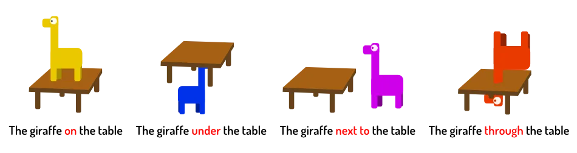

This is the last chapter before you learn about _verbs_. Prepositions often go unnoticed, but are equally important as the other elements of grammar.

You've learned what nouns are. You've learned how to refer to earlier nouns. Most of those were _pronouns_, used for referring to _people_ or _groups of people_.

But grammar is about word order and combinations. We can't just throw all nouns into a blender and expect it to mean something. We need a _glue_ that connects the nouns. A glue that tells us _how the different nouns are related_.

There are, however, a lot of glue words. You should view this chapter as more of a _reference_. Don't try to remember all of this now. Look back whenever you don't know the specific word for something.

> **Prepositions** are short words connecting two elements of a sentence.

## Type 1: Nouns
These connect nouns by saying how they relate to each other. (Remember pronouns are also a type of noun!)

For example, let's say there's a cow and a farm. We want to say where the cow is in relation to the farm. 

What do we do? We use a preposition!

{}
The cow **near** the farm. (🐄 📏 🚜)
{}

I keep repeating this, but prepositions help with _being specific_. Which is _good_.

We could just say "a cow". But by adding "near the farm", we now refer to a specific cow. And the other person knows where that cow is. A lot of information in little time.

{}
The guy **next to** the road eats an apple. (👨‍🌾 🛣️ 🍏)

The girls **on** their bike tell stories. (👧👧 🔛 🚴‍♀️ 📚)

I see two mice **under** the bed. (🐁🐁 ⬇️ 🛏️)
{}

All these examples connect a noun (like "two mice") with another noun (like "the bed"). This is a preposition. And it tells us _how_ the two are connected.

At the end I provide a table with all prepositions. As I said: don't memorize this, use it as a reference.

## Type 2: Verb + object
Prepositions can also connect the verb and the _object_. (Not the subject!)

The words are the same. But here comes another oddity of English: it's very particular about the combination of _verb_ and _preposition_. I'll explain that below.

We already know the verb is related to our object ... but _how_ is it related? A preposition answers this.

{}
The man walks. => The man walks **to** the store. (👨 ➡️ 🏪)
{}

{}
The girl sits. => The girl sits **on** the bed. (👧 🔛 🛏️)
{}

Some verbs accept all prepositions. But many come with only one or several _required_ prepositions. Whichever you choose can completely change the meaning.

There's no easy rule for this. You'll learn this from reading a lot. Even native speakers often get their prepositions wrong.

Always check the combination of preposition and verb. Otherwise, your sentence might be completely wrong or attain some other (awkward) meaning.

{}
* I am angry **with** you.
* I am crazy **about** you.
* I am jealous **of** you.

These expressions are very similar: you feel something intangible about another person. But they all use completely different prepositions.

In Dutch, _all_ these expressions would just use the same preposition ("op"). But English wants to be special.
{}

{}
I do love the expression "angry with you". It implies that being angry is something you do _together_. Like: we're both angry at each other, we're in this together. Which is weirdly poetic.
{}

## How do I know?

To check if something is a preposition, try placing it before **the closet** or **the party** in a sentence. (This is an old trick I learned and basically everyone in the Netherlands seems to know.)

{}
We talked about science => We talked **about** the party (must be a preposition ✔️)

We sat on the bench => We sat **on** the closet (must be a preposition ✔️)
{}

{}
We talked, but softly => We talked, **but** the party (that doesn't make sense ❌)

We sat like ducks => We sat **like** the party (that doesn't make sense ❌)
{}

A word like "but" is a _conjunction_. These will be taught near the end of the course: [Compounds & Conjunctions](../conjunctions-compound-words/).

## Overview

Prepositions can be neatly grouped into three categories: **time**, **place** and **movement**

They are a "closed group": no more prepositions will be added. (Nouns are very much "open": we constantly invent new words, terminology and phrases.) It's unlikely somebody invents a preposition we somehow failed to discover for thousands of years 😛

### Time

| | | | |
|-|-|-|-|
|after|at|before|by|
|during|from|past|since|
|through|to|until|upon|

### Place

| | | | |
|-|-|-|-|
|above|behind|below|beside|
|between|beyond|by|in|
|inside|near|on|outside|
|over|through|under|with|

### Movement

| | | | |
|-|-|-|-|
|against|along|down|from|
|into|off|on|onto|
|out of|toward|up|upon
