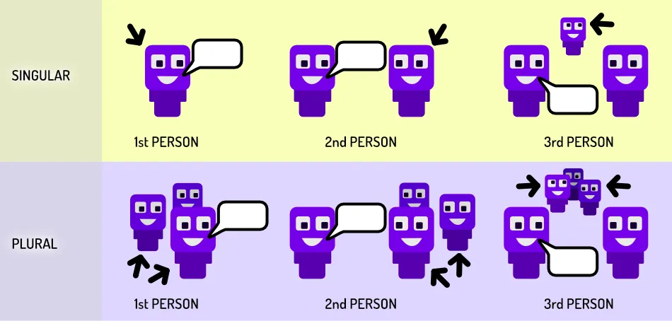

Pronouns are a subset of nouns. This means they are still _nouns_. But they are part of a special group that follows the same rules. They are used very often, because they make your communication shorter and more direct.

Why? As the name "pro" implies, it _replaces_ an existing noun. You take out a longer word and replace it with the short pronoun that refers to it. 

This does mean that the pronoun _changes_ based on what it refers to. There's no other way to learn these than reading and writing a lot, until you know all the variations.

> **Pronouns** replace nouns. They are shorter words, referring to a noun used earlier. They avoid repetition and shorten sentences. Be careful, though, that it's still obvious _what_ they refer to.

{}
Long version: "Paul saw something in the dark. The thing Paul saw in the dark was Paul's own shadow."

Pronoun version: "Paul saw something in the dark. It was his own shadow."
{}

## Personal pronouns

Below is the full table of pronouns. The rest of the article explains what each column means. I give the information at once, so you can see the patterns (to help memorize it), and because its more succinct.

We distinguish three cases:

* **1st person:** when referring to yourself 
* **2nd person:** when referring to the person _to whom_ you're speaking
* **3rd person:** when referring to someone (or something) else not in the conversation

This system is present in every language. Though many languages have some overlap. In this case, the 2nd person _singular_ and _plural_ are almost identical. 

{}
French is the same. In Dutch, the 3rd person singular female and plural are identical.
{}

### Singular

| \-                    | Subject  | Object  |  Reflexive   |Possessive   | Possessive Adjective |
| ---------------------| ---------|---------| ------------ | ----------- | ------- |
| 1st         |    I     |    me   |  myself      |  my         |   mine |
| 2nd         |    you   |    you  |  yourself    |  yours      |   your |
| 3rd male    |    he    |    him  |  himself     |  his        |   his |
| 3rd female  |    she   |    her  |  herself     |  hers       |   her |
| 3rd neutral |    it    |    it   |  itself      |             |   its |

{}
Mark is a liar. **He** keeps breaking promises.

My dog is a cutie. **It** happily runs to me whenever I get home.

This laptop is broken. **It** just won't work!
{}

### Plural

| \-                     | Subject  | Object  |  Reflexive   |Possessive   | Possessive Adjective |
| ---------------------| ---------|---------| ------------ | ----------- | ------- |
| 1st person         |    we    |    us   |  ourselves   |  ours       |   our |
| 2nd person         |    you   |    you  |  yourselves  |  yours      |   your |
| 3rd person         |    they  |    them |  themselves  |  theirs     |   their |

{}
My friends are amazing. **They** organized a surprise party!

It's too expensive for my family. **We** cannot afford it.

Facebook keeps changing their policies. **They** should figure it out for once!
{}

### Humans vs the rest

This system probably developed, again, because our sentences need a subject and a verb. Most _actions_ that happen, do so because a _person_ does them. So we developed a system where you can specifically refer to all sorts of people. (And groups of people.)

Any actions taken by non-humans will use the 3rd person neutral form (`it`). 

Over time, the 3rd person plural (`they`) therefore developed into a neutral form for _everything_. 

In English, you can refer to anything with "they" and it will sound fine. But I still recommend being more specific with your language, where possible.

Gender is often used to express a special bond with a non-human subject. Us---weird humans---really like putting our own humanity into everything, I guess 🙃

{}
This is my boat. I've had **her** for fourty years, and **she** has never failed me!
{}

## Roles

### Subject Pronouns

Use this pronoun if it is the subject of the sentence.

{}
**You** eat an apple. **I** like that.
{}

### Object Pronouns

Use this pronoun if it is the object (direct or indirect) of the sentence.

{}
He sent the letter to **me**. The man gave a book to **her**.
{}

## Reflexive Pronouns

It has two types: _reflexive_ and _intensive_. They use the same word, though their function is different.

**Reflexive** pronouns are used if the *object* is the same as the *subject*. You're reflecting on something you did to yourself!

{}
She hit **herself** with a tennis racket. We blame **ourselves** for the failure.
{}

**Intensive** pronouns are used if you want to *intensify* the subject of the sentence. They stress the importance of the subject---they repeat it. But it can be removed or left out without changing the meaning of the sentence.

{}
I baked these cakes **myself**. They **themselves** told me what I did was fine.
{}

## Possessive Adjectives

These pronouns provide an alternative for showing a possessive relationship between two nouns. This method is usually shorter. 

{}
Jack went to Jack's house (long!) => Jack went to **his** house (short!)
{}

They are placed **before** the noun to which they belong. Remember that these _don't_ follow the rules of possessive form. They already show possession on their own.

{}
* The dog broke **its** leg. 
* They went to **their** school. 
* I can't find **my** shoes.
{}

## Possessive Pronouns

These are also possesive. But use them **after** the noun to which it belongs.

{}
Long version: "Jack was a nice guy. This house was Jack's house."

Short version: "Jack was a nice guy. This house was **his**."
{}

{}
The candy was **mine**. The book was **hers**.
{}

_Why after the noun?_ This stresses the importance of the word. Look at the sentence above. "The candy was mine" is not about the candy, it's about the fact it is _your_ candy. By placing it after the noun, _who_ possesses it becomes more important than the noun itself.

The other type (*possessive adjectives*) is more common though. It's also how most people expect a possession to be expressed.