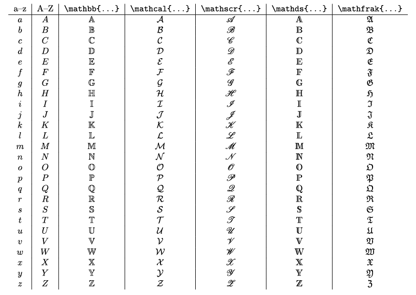

Earlier we saw two types of math environments: in line with the text (*inline*), or on its own line(s) (*block*). 

Besides changing the overall position, this distinction also changes the way certain math symbols are displayed. The most prominent differences you'll notice are:

-   Some math operators, such as fractions and square roots, are displayed smaller in inline environments.
-   Subscript and superscript components are displayed next to their element in inline environments. 

In other words, in block environments complex operators (such as sums and integrals) are promoted to a larger size and their correct location. Inline environments use smaller versions that often display somewhere else than you're used to.

These default settings, as always, are about typographical consistency and spacing. Inline environments should _stay in line_.An environment with large height would go through the text above and below it, making everything unreadable. 

Sometimes, however, you don't want this to be decided for you. Then **display styles** come to the rescue.

## Display Styles

Four display style commands are available:

| Command                 | Description |
| ----------------------- | ------------------------------------------------------------- |
| `\displaystyle`        | Changes whatever comes after it to block environment style |
| `\textstyle`           | Changes whatever comes after it to inline environment style |
| `\scriptstyle`         | Same as the previous style, but smaller |
| `\scriptscriptstyle`   | Same as the previous style, but even smaller |

These influence everything after it, until a new command comes along. Just like font size commands do with regular text, 


This fraction $\frac{5}{4}$ is some regular inline math.

This fraction $\displaystyle \frac{5}{4}$ is big and bold!

This looks odd and small:
\begin{equation}
    a^2 + \scriptscriptstyle b^2 = \scriptstyle c^2
\end{equation}


An alternative is to promise LaTeX that everything is going to be fine. "Hey man, just ignore the extra height of some equations, I know what I'm doing". 

This is done by placing the equation within the `\smash{eq}` command. If you dare do this, it's up to you to make sure the equations don't interfere with the text.

## Subscripts & Superscripts

I explain display styles early in the course because subscripts and superscripts are used *very often* in mathematical formulas. People typically know only one use: subscripts to represent indices, superscripts represent exponents. 

But there are many more use cases in mathematics. Fortunately, their syntax is easy.

* For subscripts, use `_{text}`. 
* For superscripts, use `^{text}`. 

If something has both sub and super scripts, these can just be used right after each other, any order you like.


It's trivial to see that $a_1 + \ldots + a_n = b^{2n}$.


{}
If *text* is only a single character, you can leave out the braces.
{}

{}
Sub- and superscripts may also have sub and superscripts themselves. You can stack as much of them as you like, although it's a questionable practice 📚
{}

Alternatively, while not really a subscript, the `A \atop B` command can be used to place B exactly underneath A.


It's trivial to see that $a \atop b$ $= \binom{a}{b}$


## Font Size

The display style commands already provided ways to shrink or enlarge text size. They can, however, only be used inside of math environment and don't support many sizes. 

If you want to resize one (or multiple) complete equations, you can simply use all the font size commands for regular text (`\tiny`, `\small`, ...). 

Note that you have to place these *outside* of the math environment---inside, they won't work.


\tiny $\sqrt{x^2 + y^2}$
\large $\sqrt{x^2 + y^2}$


## Alternating Text and Math

But what if you can't put something _around_ the math environment? What if the environment is big? What if the style changes multiple times inside it?

For example, in the middle of an array environment, you can't just break out of math mode to place some _regular_ text. How do we solve this?

The basic course already taught some commands for boxing in text and making it immune to their environment: the `\mbox{text}` and `\fbox{text}` commands.

But they don't support line breaks and are semantically bad. (They don't say _what_ is inside, they only say _there's a metaphorical box here_.)

Therefore, the more general `\text{text}` command is preferred.

Another oft-encountered difficulty, is that you've _lost track_ of whether you're inside a math environment at a certain point or not. 

{}
You could have started and closed an inline math environment with the dollar sign five times, but forget one somewhere in the middle. And now everything is typeset the wrong way, but you don't know where it went wrong.
{}

Obviously, I recommend figuring out the cause and solving it. But there are quick band-aids. The `\ensuremath{equation}` command ensures that whatever's inside is in math mode---no matter what happens around it.


$a = b \text{ if and only if } b = a$ \par
\ensuremath{\sqrt{x^2 + y^2}}


## Font Style

Besides the regular math letters, three other notations are available: **bolded**, **calligraphic** and **script**. 

These have quite standardized uses within scientific fields. 

{}
A bolded R is the symbol for the set of all real numbers. A calligraphic A is often used for symmetric matrices.
{}

To use these, include the `amsfonts` package. For calligraphic, include the `mathsfrs` package.

The commands to use are: 

* `\mathbb{text}`
* `\mathcal{text}`
* `\mathscr{text}`

There are two alternative styles for bolded and calligraphic letters,

* `\mathds{text}`
* `\mathfrak{text}` (*fraktur letters*)

These require the the `dsfont` package included on top of the others.