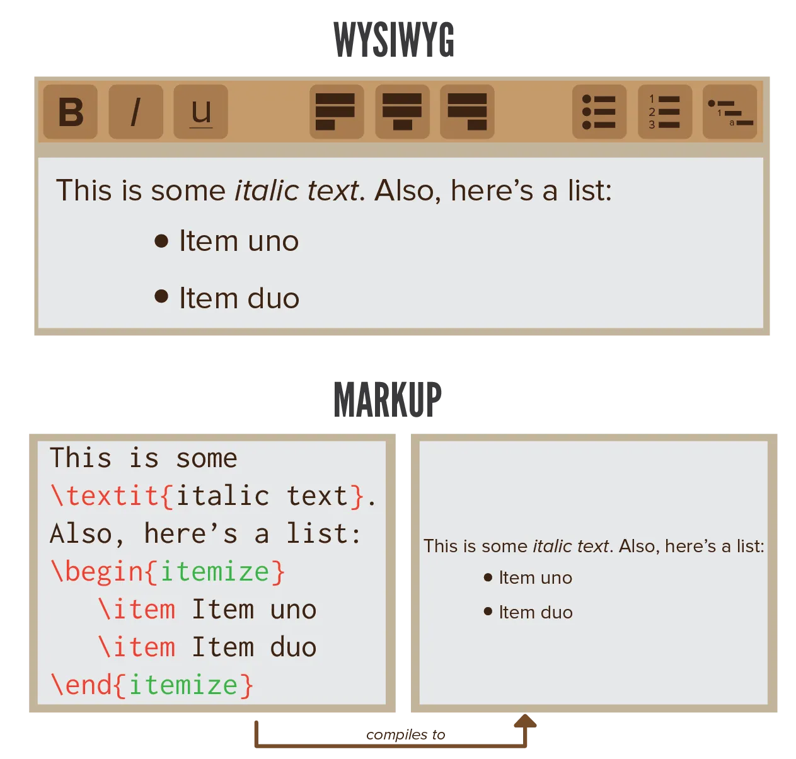

The most famous text processor of this day and age, *Microsoft Word*, is what we call a WYSIWYG editor---What You See Is What You Get. As you type, you immediately see the results and how the page will be printed. Nice, right?

But we've all experienced the bad side of *Word*. Once you try to insert a slightly fancier layout, such as images or mathematical formulas, things go horribly wrong. One moment everything looks fine, the other everything has completely changed position.

To solve these problems, and to make it easier to write scientific and professional pieces, **LaTeX** was invented.

Usually, when writers want to publish a book, they send the manuscript to the publishing company with a standard (monospaced) font and no layout, along with some instructions. The book designer at the publishing company decides on how the text will be formatted, according to these instructions, but doesn't change the text itself.

LaTeX takes over the role of the book designer. As you write something, you can place (markup) commands around certain pieces that determine how it will be marked up when the piece is compiled. Only after you've compiled it, are you able to see how it looks.

LaTeX is therefore called a markup language---a language that specifies how text must be "marked up".

By placing commands around the parts that need it, you tell the computer what the text means and how it should be formatted. This may seem more difficult at first, but once you get the hang of it and remember the commands, you can easily visualize how it will look as you are typing the commands. LaTeX aims for consistency, keeping the typographic quality high, which means you might not be able to create _beautiful_ documents, but they will always _look solid_.

Because the language uses regular text as a basis, it's really simple to learn, and you only need a few commands (and some text, of course) to create a basic structure. All you have to do is tell the computer what's what in your text. The downside of such tiny size and simplicity, is that there aren't many proper guides to LaTeX, that also teach you everything there is.

This guide aims to solve that deficit! It starts very easy, but encompasses every command available (at least, as far as I know). It's recommended to follow it in the order provided, but after a while you can pick your own chapters if you're looking for something specific.