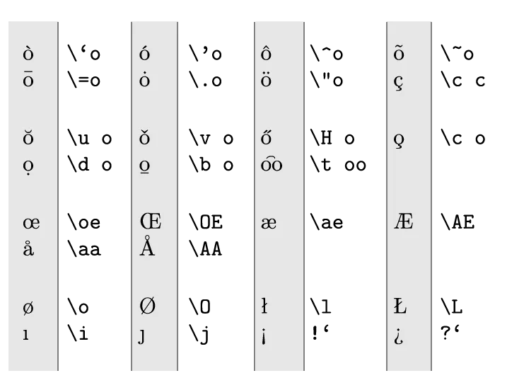

Alright, we know LaTeX will justify text, hyphenate words, and generally try to make spacing and text look as good as possible. But how does it know what to do? How does it know where to place a hyphen? We need to tell it the language we're using!

To insert support for one or multiple languages, we're going to use our first package! Meet **babel**.

## Babel

To include it with your document, use


\usepackage[languageA, languageB, …]{babel}


In case you specify multiple languages, the last one will become active. If you want to switch to another language somewhere in the document, use


\selectlanguage{language}



\documentclass{article}
% Loads English and Dutch, latter one is active
\usepackage[english, dutch]{babel}

% Now English is active
\selectlanguage{english}


## Character Sets

In order to guarantee the same output on all systems, you could declare a character set. The most extensive and popular one is **utf-8**, which is probably all you ever need. The syntax becomes


\usepackage[utf-8]{inputenc}


If special characters or symbols show up the wrong way in your document, this is one of the first things you can try.

## Accents

Instead of playing with character sets, you can also use these codes to ensure everything will always look the same:

We took the **o** as example here. Of course this works for all vowels.

## Special Characters

A few characters deserve some special attention within LaTeX.

### Quotes

People are used to typing their quotes straight or vertical (`" "`) at both ends of a quoted phrase. LaTeX, however, uses back-ticks ( `` ` `` ) for an opening quote, and verticals ( `'` ) for the closing quote. You can simply double them up if you want double quotes.


'Vertical Quotes' 
\ \ versus \ \ 
`Latex Quotes'


_Why?_ Typographically, curly or matching quotes look much nicer, so it's what Latex prefers. But it still needs to support the straight/vertical quotes in case people want to use those. This compromise---back-tick to open, vertical to close---allows this.

### Slash

LaTeX recognizes the ordinary (forward) slash ( `/` ), but treats words that contain it as one. For example, **read/write** isn't split nor hyphenated. To overcome this problem, use `\slash` instead.


Before you can start this job, you need to learn all about the famous read/write access to our file system. 

Before you can start this job, you need to learn all about the famous read\slash write access to our file system.


### Tilde

The tilde symbol can be generated with `\~{}`. But that is a high tilde, and doesn't always look good. A better alternative is often to use `$\sim$`.


That is \~{}2 dollars.

That is $\sim$2 dollars.


### Degrees

To be able to use the degree symbol freely, you need to include the `textcomp` package. (Remember how we included Babel? Same syntax, just different package name.)

The degree symbol is then simply `\textdegree{}`.


\usepackage{textcomp}

\begin{document} 
    Oh noes, it's 30\textdegree{} Celsius outside!
\end{document}


### Euro

The last version of the LaTeX font was created before the euro had even been invented. Yeah, it's that old 😟 

In fact, when the internet was just becoming a thing, there were people using LaTeX as the inspiration for website code, as it was so ubiqutous at the time. I leave it up to you to decide if it's a _good_ thing or a _bad_ thing that websites today are _not_ written in "LaTeX"-style.

Nevertheless, this means it doesn't have automatic support. To use it, include the `eurosym` package.

Then, you can use it as a standalone symbol with `\euro`, or with value attached as `\EUR{value}`.


\usepackage{eurosym}

\begin{document} 
    That will be \euro 5. 
    
    That will be \EUR{5}
\end{document} 


### Ellipsis

An ellipsis is a sequence of three dots. But, just typing three dots results in too little space between them and an ugly ellipsis, which is why you can use the `\ldots` (low dots) command.


He waited ... and even longer \ldots until he found the answer!


### Ligatures

Ligatures are special characters used for clashing letter combinations. For example, two regular **f** characters after each other usually collide and need weird spacing to solve this. Font designers spend a lot of time finding these combinations and designing special characters for them that look _way better_.

LaTeX automatically inserts ligatures that solve these particular combinations elegantly. But if you don't want them, you can place empty braces `{}` between the two letters.


The fiery thief shot the sheriff!

The f{}iery thief shot the sherif{}f!
