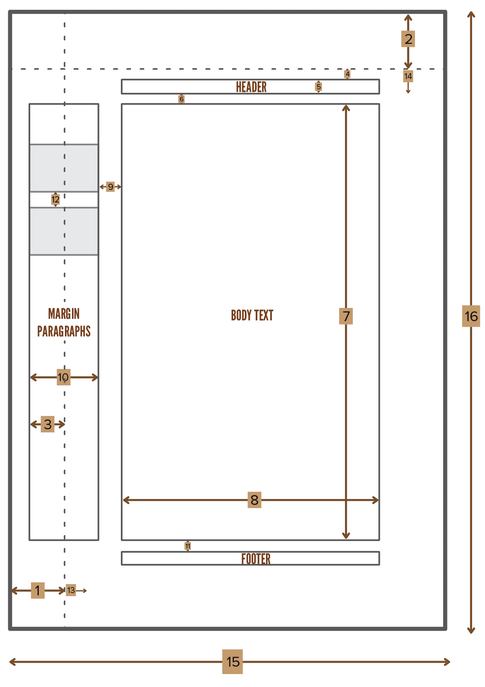

Until now we've silently accepted the size of the margins LaTeX decides. Not anymore! Let's look changing the amount of white space around your document. And how to add custom headers, footers and other notes within the margin.

## Page Layout

{}
This is a right-hand page. The whole schematic is simply mirrored for left-hand pages.
{}

All of these values are defined using regular _lengths_. This means you can change all of them the way you're used to. These internal built-in lengths are:

| Length                 | Default   | Description                                   | Number |
| ---------------------- | --------- | --------------------------------------------- | --------  |
| 1 inch + `\hoffset`   | 72pt      | Total offset from left edge                  |  1 |
| 1 inch + `\voffset`   | 72pt      | Total offset from top edge                   |  2 |
| `\oddsidemargin`      | 31pt      | Margin at the odd side                       |  3 |
| `\topmargin`          | 20pt      | Margin at the top                            |  4 |
| `\headheight`         | 12pt      | Height of the header                         |  5 |
| `\headsep`            | 25pt      | Distance between header and text             |  6 |
| `\textheight`         | 592pt     | Height of text                               |  7 |
| `\textwidth`          | 390pt     | Width of text                                |  8 |
| `\marginparsep`       | 10pt      | Distance between margin paragraphs and text  |  9 |
| `\marginparwidth`     | 35pt      | Width of margin paragraph                    |  10 |
| `\footskip`           | 30pt      | Distance between footer and text             |  11 |
| `\marginparpush`      | 7pt       | Distance between two margin paragraphs       |  12 |
| `\hoffset`            | 0pt       | Extra horizontal offset from the left        |  13 |
| `\voffset`            | 0pt       | Extra vertical offset from the top           |  14 |
| `\paperwidth`         | 597pt     | Width of the actual paper                    |  15 |
| `\paperheight`        | 845pt     | Height of the actual paper                   |  16 |

Some properties talk about *margin paragraphs*. This simply means text written in the margin of the document, which is what we're discussing next.

## Margin Notes

LaTeX supports margin notes by default, with the command


\marginpar[even side text]{odd side text}


That's great, but it doesn't support margin notes at all places. For example, footnotes and headers can't have notes written in the margin. It also has no optional arguments to remedy this.

The `marginnote` package solves this. The syntax becomes


\marginnote[vertical offset]{odd side text}


You can switch around the position of the margins with the `\reversemarginpar` command.


Lorem ipsum dolor sit amet, consectetur adipiscing elit. \marginpar[This margin is not displayed, because article document type has only one side for margin notes]{This is a cool margin note on the big, odd side} 

Proin porttitor justo quis dolor hendrerit, at ultricies nibh accumsan. Duis ut urna leo. Quisque in urna non odio suscipit faucibus quis at est. Proin in enim id leo vehicula ultricies nec at justo. Nam mattis, orci nec ullamcorper finibus, metus turpis laoreet leo, ac lacinia erat est quis risus.


## Headers and Footers

Very early in this course, you saw how to automatically set headers and footers by changing the page style. 

Now you're ready to hear: you can set them to anything you like!

* Use `\markright{text}` to set the header for all right-hand pages. 
* Use `\markboth{text}{text}` to set the header for all pages.

**Within them,** use these commands to suit your needs.

| Command           | Description |
| ----------------- | -------------- |
| `\thepage`       | The current page number. |
| `\leftmark`     |  Current chapter name, printed like "CHAPTER X. CHAPTER TITLE" |
| `\rightmark`    |  Current section name, printed like "X.Y.Z SECTION TITLE" |
| `\chaptername`  |  The actual word *chapter* in the document's language |
| `\thechapter`   |  The number of the current chapter |
| `\thesection`   |  The number of the current section. |


\section{First Section}
\pagestyle{headings}
\markboth
    {Section \thesection at page \thepage}
    {Section \thesection \ at page \thepage} 

Lorem ipsum, blabla, you know it by now, I guess.


{}
Most of these are regular counters you've already learnt about. As such, you can also use them outside of headers and footers.
{}